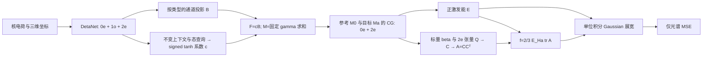

# QM9S 完整 MTO 架构：仅光谱监督的顺序实验

本版本落实用户 2026-09-14 的要求：保留规划中的完整 MTO 主模型结构，只把监督目标改为光谱。旧版直接预测 601 个谱点的实现及其结果均保留，不作为本版本结果复用。旧版全量作业 1290071 与汇总作业 1289965 已在开始运行前取消。

## 前向结构与规划对应

依据《MTO-UV_课题总纲_化学期刊定位版_2026-09-10.md》§4.1–4.6：

| 模块 | 本版本实现 |
|---|---|
| DetaNet | 3 个 block、32 通道、l_max=2、5 Å cutoff，从头训练；元素静态编码仅依赖核电荷 |
| 合法归一化 | 每个原子／类型一个 RMS，跨通道与完整 m 分量，不逐 m 单独缩放 |
| MTO 基与装配 | 每类型 16 通道，11 个查询（1 个参考因子＋10 个候选态），query 维度 32，router 两层宽 128 |
| 系数 | 按态、类型和通道生成 signed tanh 系数；共享整个 m 多重态；无原子 softmax |
| 固定缩放 | gamma=1/sqrt(N_ref)，N_ref 只由各规模训练集计算 |
| 参考关系 | e3nn FullyConnectedTensorProduct；0e 的 3 条、2e 的 4 条允许路径全部存在，通道混合可训练 |
| 标量读出 | Inv(M0)、Inv(Ma)、P0a(0e) |
| 张量读出 | 标量门控 P0a(2e) 与 Ma(2e)，不绕过 MTO |
| 物理解码 | E=softplus(hE) eV；C=beta I/sqrt(3)+Q；A=CCᵀ；f=(2/3)(E/27.211386245988)tr(A) |
| Cartesian 基 | 由 e3nn ReducedTensorProducts 推导对称张量基，取 2e 部分；有旋转与反射协变测试 |
| 可微光谱 | S(E)=Σ f K_sigma(E−Ea)，K 为单位积分 Gaussian；601 点，1.5–13.5 eV，sigma=0.2 eV |
| 监督 | 唯一数据损失为 MSE(S_pred/train_RMS, S_target/train_RMS)；无 E、A、f、轨道、秩等辅助损失 |

优化器仍采用 AdamW 的 weight decay；它不是额外物理量监督。所有新增模块均参加前向与反向传播，没有保留一个可绕过 E/A/f 的直接光谱头。

sigma=0.2 eV 是规划初始值。本次只读检查源目录 notebook 后，尚不能确认原 CSV 的生成宽度及绝对振子强度标度，因此不把这些约定说成已经验证的数据物理单位。光谱监督下，候选态分解与 A 的方向不可唯一辨认；输出用于结构化预测和诊断，不当作已恢复的真实电子态或轨道。只在导出时给出按能量排序的索引，训练光谱求和对态排列不敏感，不以未提供的电子态标签进行匹配。

实现参考：[e3nn 的可训练 TensorProduct](https://docs.e3nn.org/en/stable/api/o3/o3_tp.html)。具体调用及 Cartesian 映射以 bjhpc 安装版本的实际数值测试为准。

## 对照与数据

对照是 DetaNet 固定求和池化，使用不变标量读出和门控的池化 2e 张量，也通过相同的 E/A/f/Gaussian 解码器预测光谱。它不含 MTO 的态条件原子装配和参考 CG。通过活跃读出宽度匹配参数量：baseline 179057、MTO 178972，共享 backbone 77056，相差 0.0475%。这次比较是完整结构的新实验，不能直接与旧版 1k/10k 数值拼接成同一学习曲线。其他规划消融属于后续实验，本次提交两个主比较分支。

| 顺序 | 规模 | Train / Validation / Test | 配对种子 | 拟合次数 |
|---|---|---|---|---|
| 1 | 1k | 800 / 100 / 100 | 11,23,37,53,71 | 10 |
| 2 | 10k | 8000 / 1000 / 1000 | 11,23,37,53,71 | 10 |
| 3 | 全量有效 QM9S | 103785 / 12973 / 12974 | 11,23,37 | 6 |

沿用已审计、身份去重后的 129732 个有效分子、原有分子坐标与 601 点源光谱。保留历史 1k 身份和划分，三种规模按 train/validation/test 分别嵌套；文件 SHA256 与嵌套性已经验证。全量的去重／零光谱排除明细保留在 data/audit.json。各规模单独计算训练集 RMS，测试集不参与归一化。

## 训练、验证与产物

配置在新测试预测前一次冻结，不根据较小规模的新测试结果改后续规模配置。每对模型共享 backbone 初始化、epoch 内数据顺序与优化规则：batch=32、AdamW lr=0.001、weight decay=0.0001、clip=5、warmup=5、cosine floor=0.05；最多 180 epochs，至少 40 epochs，validation MSE 连续 30 epochs 不改善时早停。模型不共享已训练参数，不跨规模 warm start。

模型结构的 7 项测试包括装配恒等式、全部 CG 路径、初始化和参数匹配、平移／旋转／反射、原子置换与 batch 一致性、PSD／单位／光谱积分／偏振迹关系、纯光谱损失回传到所有参数。流程测试用隔离的合成数据检查三个规模的统计、报告和调度依赖，不代表预测精度。

1k 作业内先运行 GPU 检查：32 个固定训练分子的两分支过拟合（最多各 600 步，要求最好归一化 MSE <0.1 且低于初始值的 30%）、模型和优化器恢复数值检查、实际训练器的中断续训。检查失败则 1k 正式训练及后续阶段全部停止，不能跳过失败继续。

每个规模完成所有配对拟合后，才打开该规模测试预测，并在共同留出分子上评估。输出归一化／源单位误差、cosine、Pearson、配对种子差、条件分子 bootstrap 与精确双侧 sign-flip；五对和三对种子的最小可能 p 分别为 0.0625 和 0.25。共同留出集排除历史 1k 的 100 个测试身份，但旧版 10k 的测试结果已被查看，不能描述为完全未接触的测试集。

保存每个种子的全套 E/A/f、有效秩与 PSD 诊断，并对四个预先固定的示例保存原子基、系数、装配项、MTO、CG 和全部物理解码中间量。示例按冻结身份顺序选择，不挑表现好的分子。生成各规模比较图、验证曲线、示例光谱及 Markdown 报告。

## 严格顺序与恢复

每阶段分配同一节点的 2 张 GPU，按种子交错分配两个 worker；每个配对内两个分支依次运行。三阶段 Slurm 作业用 afterok 串联。**训练、全部测试／统计／图表和装配导出成功后，才写 STAGE_COMPLETE.json 并成功退出，放行下一阶段。** 同时检查上一阶段标记及冻结代码指纹。失败将阻断后续阶段。

预设 wall time 为 1k 12 小时、10k 48 小时、全量 7 天，是调度上限，不是运行时间估计。实际停止取决于冻结训练规则。epoch checkpoint 保存模型、AdamW、学习进度和 RNG；接近时限时请求保存并 requeue 同一个作业，保留后续依赖。已完成的分支和种子自动跳过。

服务器：`/data/run01/sczc698/xxy/MTO_fullarch_20260914`，Python：`/data/run01/sczc698/.conda/envs/cheng/bin/python`。作业号在 jobs/submission.json；查看 scripts/status.py；最终全链以 full/STAGE_COMPLETE.json 为准。
