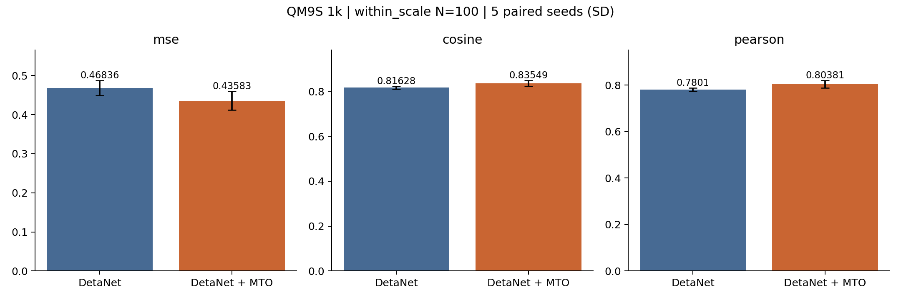
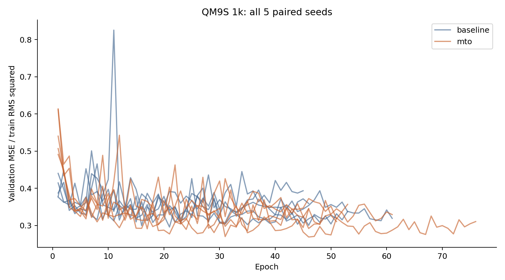
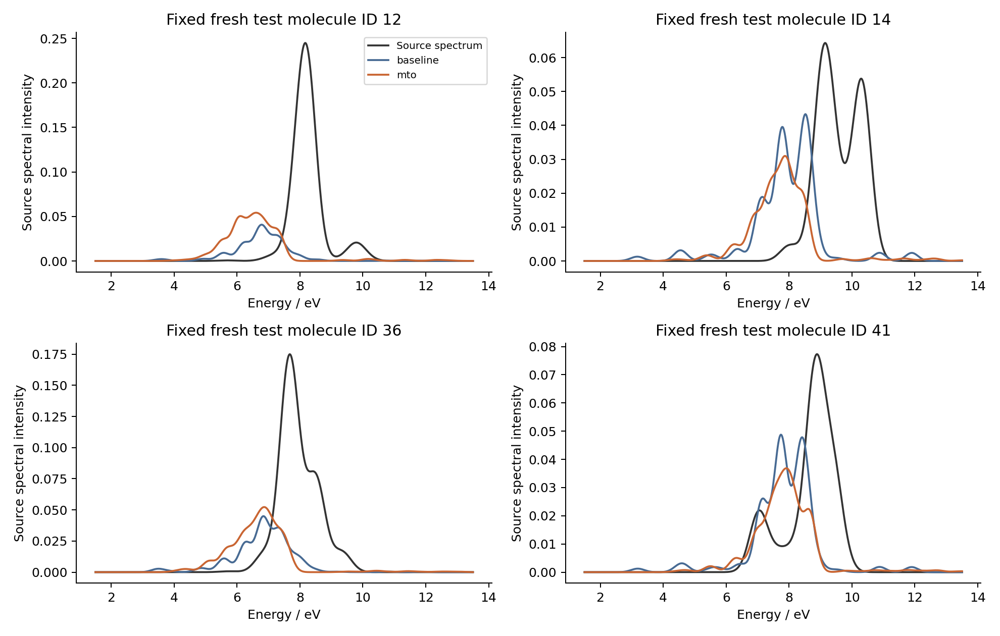

# QM9S 1k：完整 MTO 架构、仅光谱监督的对比实验报告

MTO 的平均测试归一化 MSE 较对照降低 **6.95%**，在 **4/5** 对种子中改善。该规模的全部训练、评估、统计、图表及中间张量导出已完成。

## 1. 实验设置

- 数据划分：800 train / 100 validation / 100 test。按分子身份冻结，嵌套于全量对应划分。
- 五对种子：11、23、37、53、71。每对从头训练，共享 DetaNet 主干初始化与数据顺序。
- MTO：DetaNet 3 blocks、32 通道；1 个参考因子＋10 个候选态；每类型 16 个 MTO 通道；CG 输出 0e 和 2e。
- 对照：DetaNet 固定求和池化＋相同 E/A/f/Gaussian 解码结构，活跃参数量匹配；对照不包含 MTO 装配或参考 CG。
- 参数量：对照 179057，MTO 178972，差异约 0.0475%。
- 训练：AdamW lr=0.001、weight decay=0.0001、batch=32、clip=5；最多 180 epochs，至少 40 epochs，验证 MSE 的 patience=30；warmup=5、cosine floor=0.05。
- 光谱：1.5–13.5 eV，共 601 点；单位积分 Gaussian，σ=0.2 eV。
- 唯一数据损失：MSE(S_pred / r_train, S_target / r_train)，r_train=0.0245984902553。无 E、A 或 f 标签监督。

## 2. 冻结测试集结果

数值为五个训练种子的均值 ± 样本标准差。

| 指标 | DetaNet 对照 | DetaNet + MTO |
|---|---:|---:|
| 归一化 MSE ↓ | 0.468359 ± 0.0193 | 0.435826 ± 0.0239 |
| 归一化 MAE ↓ | 0.228872 ± 0.00652 | 0.219287 ± 0.00784 |
| Cosine ↑ | 0.81628 ± 0.00611 | 0.83549 ± 0.0133 |
| Pearson ↑ | 0.780099 ± 0.00729 | 0.803806 ± 0.0163 |
| 源单位 MSE ↓ | 0.000283398 ± 1.17e-05 | 0.000263712 ± 1.45e-05 |

### 逐种子归一化 MSE

| 种子 | 对照 | MTO | MTO−对照 |
|---|---:|---:|---:|
| 11 | 0.460261 | 0.471005 | +0.010744 |
| 23 | 0.501274 | 0.412008 | -0.089265 |
| 37 | 0.463041 | 0.448183 | -0.014858 |
| 53 | 0.450979 | 0.428915 | -0.022064 |
| 71 | 0.466243 | 0.419021 | -0.047222 |

## 3. 不确定性与解释

MTO−对照的归一化 MSE 平均差为 -0.032533。先平均配对种子差、再按分子 bootstrap 的条件 95% 区间为 [-0.067970, -0.001211]。

五对种子的精确双侧 sign-flip p=0.1250。五对种子的该检验最小可能 p 为 0.0625；本结果不支持在 0.05 阈值下宣称种子层面的显著性。分子 bootstrap 以当前划分和已拟合模型为条件，不能替代训练集重采样的不确定性。

## 4. 共同留出集

使用同一批 12874 个留出分子，便于跨规模比较。应比较源单位误差，各规模的训练 RMS 不同。

| 指标 | DetaNet 对照 | DetaNet + MTO |
|---|---:|---:|
| 源单位 MSE ↓ | 0.00035716 ± 6.24e-06 | 0.000340355 ± 9.3e-06 |
| Cosine ↑ | 0.807724 ± 0.00429 | 0.82768 ± 0.00305 |
| Pearson ↑ | 0.768137 ± 0.00509 | 0.793061 ± 0.0041 |

共同留出集上的 MSE 相对改善为 4.71%。该集合排除历史 1k 的 100 个测试身份，但与规模内测试部分重合。历史旧版 1k/10k 的测试结果已经看过，不能称其为从未接触的独立测试集；新版配置未根据这些新测试预测调整。

## 5. 图表

示例按预先固定身份顺序选取，不按预测好坏筛选；图中的预测为种子平均。

## 6. 架构核验与适用范围

再次核验了两规模共 20 个已训练 checkpoint 的源码哈希、配置、训练指纹与严格加载；10 个 MTO checkpoint 的纯光谱反传均到达 DetaNet、状态装配、参考 CG、能量头、beta 头及张量门控。E/A/f、PSD 关系、展宽输出和已保存的原子装配中间量均通过检查。

[逐模块代码复核](完整模型结构复核.md)；[机器可读核验数据](代码核验数据.json)。

仅各向同性光谱监督不能唯一确定逐态分解及 A 的方向；导出的 E/A/f 是结构化预测，不能视作已得到独立物理量验证。σ=0.2 eV 为模型设定，尚未确认本次源 CSV 的实际展宽宽度和绝对振子强度标度。

逐种子指标：[per_seed.csv](../results/1k/per_seed.csv)；原始汇总：[comparison.json](../results/1k/comparison.json)。每个种子的 states_*.npz 存储 E/A/f，mto_assembly_examples_seed*.pt 存储四个固定示例的完整中间量。

