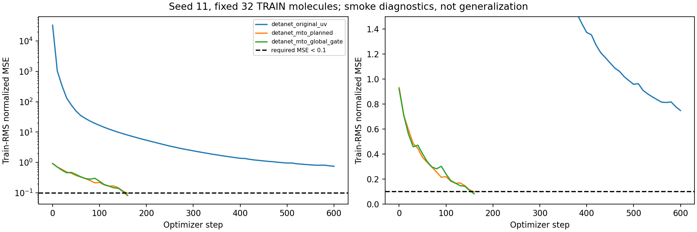
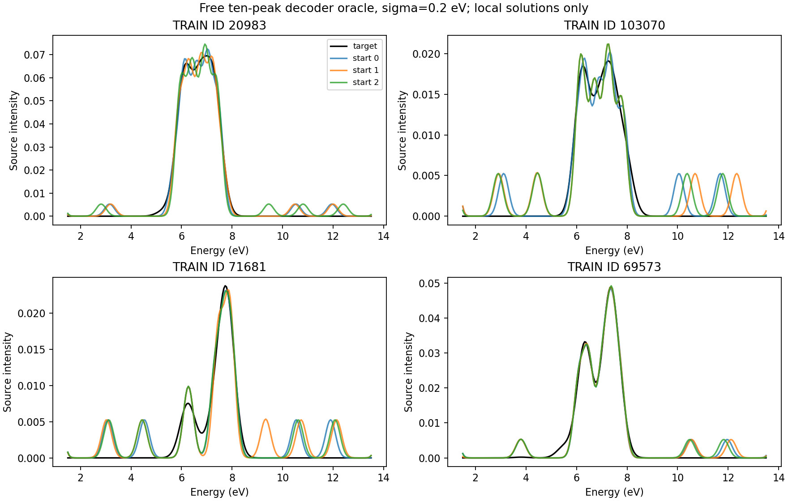

# 本轮状态：正式 1k 被 A 的冒烟门槛阻断

工作区：`/data/run01/sczc698/xxy/MTO/experiments/detanet_original_mto_1k_20260920`，位于已经核实的用户指定 `xxy/MTO` 内。SSH 别名为 `bjhpc`。

**代码已实际修改、CPU/GPU 测试已执行、4 个 Slurm 前置验收作业已实际提交。正式 15 次 1k 拟合为 0 次提交、0 次完成；没有模型测试集评估，没有 STAGE_COMPLETE 标记。**

## 阻塞证据

使用固定 seed=11、同一组 32 个训练分子、原定 Adam/AMSGrad/lr=1e-3、无裁剪、无额外正则、FP32 和共同训练 RMS。模型均从头初始化。每 10 步记录训练损失，达到门槛才提前结束，否则最多 600 步。

| 分支 | 初始归一化 MSE | 最佳归一化 MSE | 最佳/初始 | optimizer steps | 实测训练秒数 | 门槛 |
|---|---:|---:|---:|---:|---:|---|
| A 原版 DetaNet UV | 33109.1953 | **0.7482212** | 0.0000225986 | 600 | 30.796 | **失败：未小于 0.1** |
| B 规划 MTO | 0.9325631 | 0.0968031 | 0.1038033 | 160 | 11.688 | 通过 |
| C global-gate | 0.9221783 | 0.0817474 | 0.0886460 | 160 | 11.751 | 通过 |

依据本次请求第六节 E：最佳归一化 MSE 必须 `<0.1` 且低于初值 30%，最多 600 optimizer steps；关键前置检查失败时阻断正式训练。因此不能跳过 A、降低门槛、改变原版头初始化或悄悄延长训练后宣称原协议通过。

A 的原版数值等价已经通过，训练损失下降明显且仍在改善；目前证据表明它没有在指定的小预算内达到绝对过拟合门槛。A/B 初始输出尺度差异很大，AMSGrad 的历史二阶矩可能影响后续优化速度，但这只是待进一步验证的解释，不是已经证明的唯一原因。B/C 的冒烟数值不能解释为测试集优势，也不能据此宣布 MTO 胜过原版。



## 已实际通过的检查

- CPU float64、GPU float64、GPU float32 各 7 项模型验收通过。独立 reference 包和项目 vendor 包不是同一包装对象。
- 固定随机权重和官方 UV checkpoint 均 strict load；CPU 逐层前向及共同参数梯度最大差值 0。GPU 使用预先规定的精度容限；最终 FP32 最大参考比较差值 1.5259e-5（含梯度），MTO O(3) 各中间量最大绝对差值 4.7684e-7。
- 最后一个 block 的原始 S/T 与 latent 接口相同；保留 3o；按 irreps 元数据打包/解包及重复 irrep 往返通过。
- F=cB、M=gamma sum(F)、同类型通道投影、统一 m 系数、七类 CG 路径、B 原子/状态依赖、C 原子维恒定和状态依赖通过。
- 旋转、反射、平移、置换、batch 重组、H/B/F/c/M/CG 变换及 Q/A Cartesian 协变通过。全部 1000 个分子的 CPU/GPU 边集相同，最大邻居数 26。
- Q 对称无迹、A 对称 PSD、tr(A)=beta²+||Q||²、能量/强度非负、eV/Hartree 转换、Cartesian 基归一化、宽域 Gaussian 积分和有限窗 CDF 检查通过。
- 纯光谱损失经过 MTO→CG→E/Q/C/A/f→展宽并回传；小模块组合 gradcheck 通过。完整 B/C 的所有参数在测量 batch 上均有梯度记录。
- batch=64 的三分支 GPU forward/backward 通过，最大分配显存分别约 1.164/1.256/1.278 GB，没有 OOM，也没有改动 effective batch。
- GPU 从磁盘恢复模型/优化器/scheduler 的张量逐位相同；后续一步模型与损失检查通过；Adam 动量按实际梯度及机器精度舍入界核验通过。GPU 原子求和存在数值非确定性，不承诺长期轨迹逐位相同。
- 实际训练器的 3 步连续运行与 1+2 步中断恢复，在分配作业内使用 CPU 做严格相等比较；模型、optimizer、scheduler、全部 RNG、epoch/step、数据顺序和 cursor 相同。
- 独立 CPU 工程合同测试通过：不等长梯度累积与完整 batch 的更新参数差值 0，loss 差值 3.55e-15；原子化保存、RNG/scheduler 恢复、错误数据指纹拒绝均通过。

模型验收日志见 `logs/acceptance_{cpu,cuda}_{float64,float32}.{log,json}`，工程日志见 `logs/engineering_contracts.log`、`reports/resume_cpu_gpu.json`。

## Decoder oracle 与结构诊断

仅使用预先固定的训练 ID `[20983,103070,71681,69573]`，直接优化十个 E/f，固定单位积分 Gaussian、sigma=0.2 eV。3 个起点各 800 步；这没有用于调整宽度或峰数。

| 起点 | 原 oracle 归一化 MSE | 换算到共同 800-train RMS 的 MSE |
|---|---:|---:|
| 0 | 0.0156926 | 0.00561085 |
| 1 | 0.0189395 | 0.00677177 |
| 2 | 0.0224423 | 0.00802418 |

Oracle 原归一化用这 4 个训练目标共同的 RMS=0.01468848；正式公共训练 RMS=0.02456461。二者已分别标注。合成可实现谱的最佳归一化 MSE 约 3.9e-13。局部优化结果不是全局误差下界，也不能证明源 CSV 的展宽来源。



冒烟后的 B/C gates 饱和率均为 0；有效强度态数均值分别 8.5/9.5；Q 的 RMS 分别 0.03889/0.05200，未完全失活。B 的部分预测能量超出观测窗，已保留原值，没有截断。实际梯度范数、能量范围和张量量级在 JSON 中。

另在同一组预先固定的训练 ID 上导出 **初始化状态** 的 B/F/c/M/CG/E/Q/C/A/f、形状、PSD 和有限窗积分诊断，位于 `reports/initial_assembly/`。这些明确标为 `INITIALIZATION_ONLY`，不是正式训练结果或真实轨道。正式训练后的导出仍未完成。

## 真实作业记录

| Job ID | 最终状态 | ExitCode | 节点 | 内容 |
|---|---|---|---|---|
| 1298912 | FAILED | 1:0 | g0041 | GPU float64 人工密集图的邻居上限测试假设失败；已定位上游 32/33 行为 |
| 1298941 | FAILED | 1:0 | g0024 | float64 通过；FP32 独立距离参考误把 cdist 对角舍入当作边 |
| 1298945 | FAILED | 1:0 | g0045 | CPU/GPU 模型测试通过；后续 GPU optimizer 动量逐项比较失败，之后单独审计精确恢复与原子加法舍入 |
| 1298973 | FAILED | 1:0 | g0006 | 模型、oracle、恢复和 batch64 检查通过；仅 A 的 600 步冒烟门槛失败 |

每个作业分配 1 GPU、8 CPU。最后一作业是 RTX 4090 24 GB、driver 550.135，总时长 7 分 25 秒。所有失败日志保留；没有取消用户已有作业。无新 1k 正式任务排队或运行。

## 来源、适配与新旧口径

作者 commit：`4f92e643ab64651b91c4a1392cf389ddfd0d89f0`。论文 DOI 归档访问返回 403，因此尚未验证 GitHub 与论文归档逐字一致。详见 `SOURCE_AND_MODEL_AUDIT.md` 和 `PLAN_IMPLEMENTATION_TEST_MAP.md`。完整总纲与数学摘要已经取得，未冒称只读摘要就核对全文。

原工作区没有 Git 元数据，修改前 SHA 不存在；已保存原文件快照和 SHA256。新实验的 Git 历史位于其独立子目录，源码和运行协议均可审计。Python 环境是此目录的独立 venv，使用 e3nn 0.4.4，未升级共享 cheng 环境；PyTorch 2.3.0+cu121、PyG 2.6.1、scatter 2.1.2+pt23cu121、cluster 1.6.3+pt23cu121。

240 点坐标来自作者 notebook 的 `torch.linspace(1.5,13.5,240)`。现有 601 点目标固定线性重采样，所有分支共用；原文件不变。仅训练集计算 N_ref=18 和标签 RMS。源展宽仍未知、sigma=0.2 eV 是公开的初始假设、绝对强度单位不臆造。

**本轮是原版模型代码/架构等价加目标网格适配，不是论文全过程复现。** 新协议与旧的 32 通道/601 点/不同优化器和读出的实验不同口径；当前没有新的正式测试指标可与旧结果比较。历史测试集不能重新称作完全未接触。

## 后续权限与命令

当前协议仍是原始 v1，600 步上限未改。可审阅的候选文件 `proposals/protocol_v2_smoke2000.json` 只提出把 **三组共同冒烟上限** 改为 2000 步，其他模型、优化器、门槛和正式 1k 预算不变。它未激活、未执行，必须由用户授权；即使授权也只是一次有界检查，不保证 A 通过，更不保证 MTO 获胜。

当前状态查询：

```powershell
ssh bjhpc 'sacct -j 1298912,1298941,1298945,1298973 --format=JobID,State,ExitCode,Elapsed,NodeList -P'
ssh bjhpc 'cat /data/run01/sczc698/xxy/MTO/experiments/detanet_original_mto_1k_20260920/reports/smoke_seed11.json'
```

仅在前置门槛真实通过并产生与冻结指纹相符的 `reports/PREFLIGHT_PASSED.json` 后，才可以提交 `jobs/train_array.slurm`（15 项、最多同时 2 GPU），随后以 afterok 提交 `jobs/report.slurm`。现在直接启动训练器会因缺失前置通过标记而拒绝。

正式续训入口是 `env/bin/python train.py --seed <seed> --variant <variant>`，由同一数组脚本在分配的 GPU 内运行；它从本命名空间 `runs/seed_<seed>/<variant>/last.pt` 恢复，并拒绝代码/配置/数据、seed 或分支不匹配。当前 `runs/` 没有正式 checkpoint，不能拿 `reports/` 中的工程检查权重初始化正式训练。

尚未完成：15 次正式拟合、验证选优曲线、统一测试指标/预测、正式模型示例谱和训练后组装导出。因此不写 STAGE_COMPLETE。
