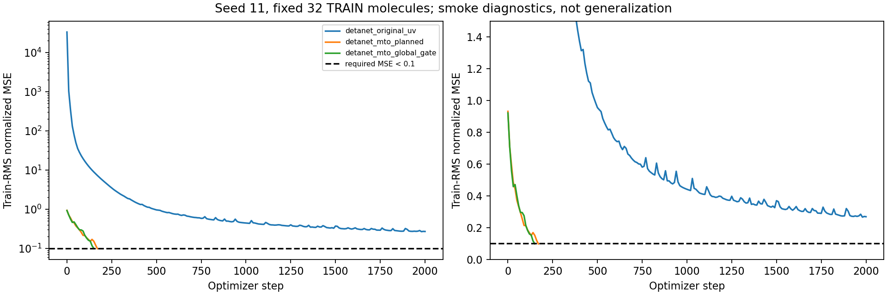

# v2 实际结果：2000 步冒烟仍被 A 阻断

工作区 `/data/run01/sczc698/xxy/MTO/experiments/detanet_original_mto_1k_20260920`，SSH 别名 `bjhpc`。

**本轮已实际启动并结束。作业 1299137：FAILED，退出码 1:0，节点 g0017，RTX 4090，耗时 9 分 20 秒。正式 15 次 1k：0 提交、0 完成、0 排队；没有模型测试集评估，没有 STAGE_COMPLETE。**

用户授权后，v2 只把三组共同冒烟上限从 600 改为 2000 步。32 个训练分子、seed=11、初始权重、优化器、通过门槛、模型结构和正式 1k 预算均保持不变。三组均从头初始化，没有续用 v1 冒烟权重。

| 分支 | 初始归一化 MSE | 最佳归一化 MSE | 步数 | 实测训练秒数 | 结果 |
|---|---:|---:|---:|---:|---|
| detanet_original_uv | 33109.195 | 0.26642415 | 2000 | 101.572 | 失败：未达到 <0.1 |
| detanet_mto_planned | 0.93256307 | 0.098248154 | 170 | 12.088 | 通过 |
| detanet_mto_global_gate | 0.92217833 | 0.099066176 | 150 | 10.942 | 通过 |

A 的最佳值发生在第 1980 步；第 2000 步当前值为 0.26917714。B/C 达到共同双门槛后按预设规则停止；不能用这些不同停止步数的终点判断优劣。相同初始权重在 CUDA 原子加法下不保证长期训练轨迹逐位一致，因此 v1/v2 的 B/C 通过步数略有变化。



## 本次重新执行通过的检查

- CPU float64、GPU float64、GPU float32 各 7 项验收均通过，退出码 0；包含独立 reference/官方权重严格加载、逐层/梯度等价、组装/CG、O(3)、物理代数与可微性。
- GPU batch64 forward/backward、CPU/GPU 一致性、磁盘精确恢复、Adam 更新算术检查以及实际训练器 CPU 3 步与 1+2 步中断恢复均通过。
- 固定训练分子的 decoder-oracle 和合成可实现谱检查通过。真实目标拟合的共同训练 RMS 归一化 MSE 最佳约 0.00561085；该局部解不是全局误差下界，也没有用于选择宽度。
- B/C 冒烟后 gates 饱和率均为 0，张量分支未完全失活。实际能量范围、有效态数和张量量级见 `reports/smoke_seed11.json`。

## 保留的边界

固定作者 SHA `4f92e643ab64651b91c4a1392cf389ddfd0d89f0`；归档代码仍未取得，未验证与论文归档逐字一致。现有 601 点目标统一适配到作者 240 点网格；源展宽未知，sigma=0.2 eV 仍是公开假设。不能称论文全过程复现，不能从短程训练损失宣称泛化优势或恢复真实轨道/张量方向。

原工作区没有 Git 元数据；修改前源码/配置快照与 SHA256 已保留。新实验独立 Git 分支为 `codex/detanet-original-mto-1k`，v2 协议代码提交 `9bf982df5bf03551fc3faf8ce878a9634fd59fd7`。源码数值实现未因延长冒烟而更改。

## 文件与状态查询

- `audit/v2_preflight_result.json`：本轮汇总及验收日志哈希。
- `logs/preflight-1299137.log`：实际 oracle、冒烟逐步损失及失败栈。
- `logs/acceptance_{cpu,cuda}_{float64,float32}.json`：对应实际测试记录；CPU float32 不属于本次执行组合。
- `reports/smoke_seed11.json`、`reports/resume_cpu_gpu.json`、`reports/decoder_oracle.json`：实际诊断。
- `history/v1_preflight_1298973/`：完整 v1 原始报告、配置和日志归档。
- `SOURCE_AND_MODEL_AUDIT.md`、`PLAN_IMPLEMENTATION_TEST_MAP.md`：来源、适配和完整规划对应关系。

```powershell
ssh bjhpc 'sacct -j 1299137 --format=JobID,State,ExitCode,Elapsed,NodeList -P'
ssh bjhpc 'cat /data/run01/sczc698/xxy/MTO/experiments/detanet_original_mto_1k_20260920/reports/smoke_seed11.json'
```

本轮按授权的一次有界尝试结束，不自动再增加步数、降低门槛或修改 A。缺少有效 `PREFLIGHT_PASSED.json`，正式入口继续拒绝启动。新正式测试指标、五种子验证选优曲线、正式预测和训练后解释导出仍未产生；与旧实验也不是同口径结果。
