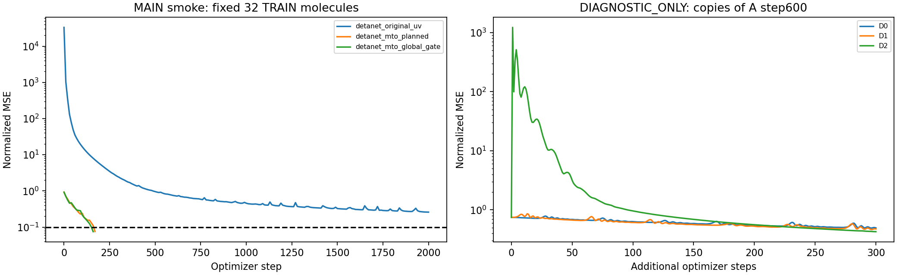
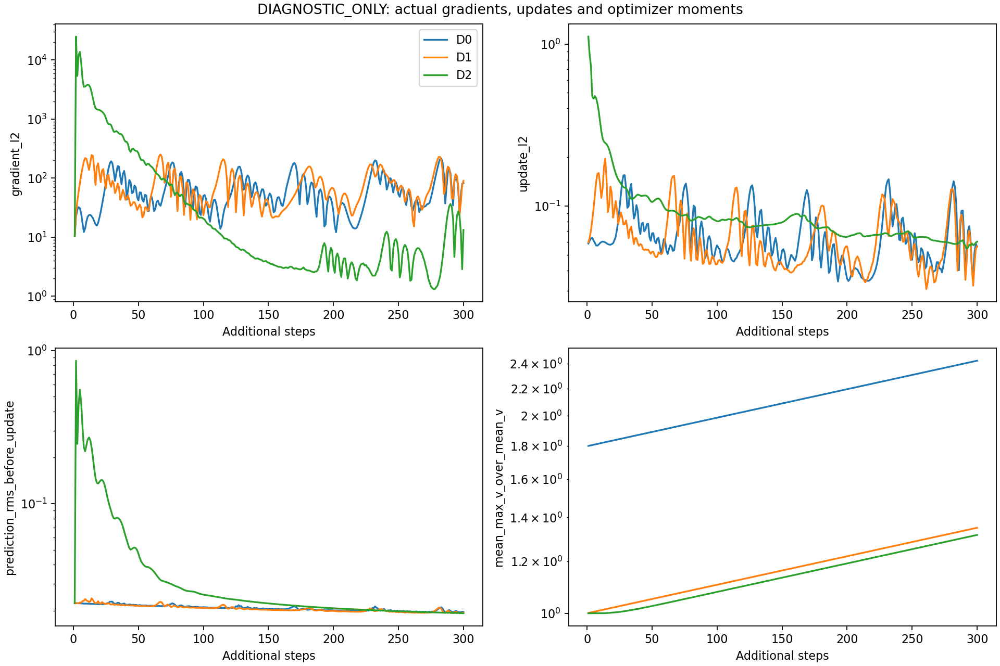

# Instrumented v2 smoke and bounded diagnostics

Actual main Slurm job: 1299173. Correction metadata: {"job_id": 1299178, "status": "COMPLETED", "exit_code": "0:0", "directory": "/data/run01/sczc698/xxy/MTO/experiments/detanet_original_mto_1k_20260920/reports/D1_correction_1299178", "source_unchanged": true}.
Main policy: fixed seed 11, the same 32 TRAIN IDs and [32,240] targets, common original 800-training RMS, 2000-step maximum and original early-success thresholds. The v1 600-step cap was a human engineering budget, not an author-paper rule.
models.py, train.py and protocol.json are byte-identical to the preceding authorized v2. preflight.py now invokes observation/checkpoint/diagnostic code; this instrumentation is documented separately from the earlier budget change.

## Data and actual fresh initialization
Training RMS: 0.02456461297439197; recomputed from the original 800 training targets: 0.02456461297439197.
Zero-spectrum normalized MSE on these 32 molecules: 0.7710882439. Pointwise common-mean spectrum MSE: 0.4633770329.
Actual fresh A tensors equal fresh independent author constructor: True; initialization call sequence equal: True; constructor RNG equal: True.
No same-state_dict loading is used for that fresh-constructor audit. Original author constructor resets are retained. All arrays assert exact [32,240] shape; ordered labels are checked; normalized_MSE=raw_MSE/train_RMS² is independently verified.

| Initial A quantity | RMS | Minimum | Maximum |
|---|---:|---:|---:|
| Embedding | 0.70093742 | -0.16361016 | 3.1607687 |
| Radial | 0.097724807 | -0.32662007 | 0.32861081 |
| blocks.0/0 | 0.7016557 | -0.20036733 | 3.1775897 |
| blocks.0/1 | 0.013934353 | -0.13034727 | 0.1280693 |
| blocks.1/0 | 0.70208074 | -0.20356598 | 3.1817753 |
| blocks.1/1 | 0.017481658 | -0.15451437 | 0.16235022 |
| blocks.2/0 | 0.70250579 | -0.20589921 | 3.1866481 |
| blocks.2/1 | 0.021372077 | -0.20701629 | 0.25013578 |
| sout.mlp.0 | 0.69742946 | -2.4049201 | 2.4735429 |
| sout.mlp.1 | 0.40791717 | -0.16361021 | 2.437356 |
| sout.mlp.2 | 0.40791717 | -0.16361021 | 2.437356 |
| last_linear_input | 0.40791717 | -0.16361021 | 2.437356 |
| sout.mlp.3 | 0.33799166 | -1.1299559 | 1.1599425 |
| sout | 0.33799166 | -1.1299559 | 1.1599425 |
| molecular_output | 4.4696686 | -20.754641 | 19.8948 |
| target | 0.021570587 | 0 | 0.19691461 |

## Main smoke — these alone determine the smoke gate
| Branch | Initial MSE | Best MSE | Best step | Steps executed | Passed |
|---|---:|---:|---:|---:|---|
| detanet_original_uv | 33109.1953 | 0.259625256 | 2000 | 2000 | False |
| detanet_mto_planned | 0.932563126 | 0.0757228807 | 170 | 170 | True |
| detanet_mto_global_gate | 0.922178328 | 0.0749933794 | 160 | 160 | True |

All existing initial, step600, best and last checkpoints were strictly reloaded, including optimizer state; their losses were recomputed from the real saved weights. CPU/GPU roundoff differences are retained in checkpoint_revalidation.json. Smoke/diagnostic checkpoints have formal_initialization_allowed=false.

## DIAGNOSTIC_ONLY: original last-linear-layer SVD
Earlier layers are frozen in independent CPU float64 copies. Phi=sum_i h_i; X=[Phi,N] has shape [32,129]. The last column is atom count N. Minimum-norm rank-truncated SVD is used, with tolerance max(m,n)*eps*smax. Solutions are written into the original final per-atom linear layer and checked by full forward.
| Source A checkpoint | Rank | Condition | Solution norm | SVD normalized MSE | Full-forward normalized MSE |
|---|---:|---:|---:|---:|---:|
| initial | 32 | 7997.49686 | 11.4503654 | 1.29166019e-26 | 1.02163872e-26 |
| best | 32 | 3471.23229 | 4.99918086 | 2.37265268e-28 | 2.10268801e-28 |
| last | 32 | 3471.23229 | 4.99918086 | 2.37265268e-28 | 2.10268801e-28 |

## DIAGNOSTIC_ONLY: AMSGrad interventions
The first D1 run was invalidated: loading a reused optimizer dictionary shared a CPU step tensor, which D0 incremented from 600 to 900. The main smoke, SVD, D0 and D2 were unaffected. D1 alone was rerun from the immutable disk checkpoint with a deep copy, first/last optimizer counters 601/900, and explicit source-state immutability checks. Invalid records and both executed source versions are preserved; this is a diagnostic engineering fix, not a mere budget extension.
All copies begin with identical A step600 model tensors and the same training batch. D0 retains every optimizer state. D1 changes only max_exp_avg_sq to exp_avg_sq and is a nonstandard intervention. D2 starts a new same-configuration AMSGrad; it resets first/second moments and bias-correction history, so its effect cannot be attributed solely to the historical maximum.
| Diagnostic | Starting MSE | Best MSE | Last MSE | Additional steps | First update L2 | Last update L2 |
|---|---:|---:|---:|---:|---:|---:|
| D0 | 0.74884814 | 0.495513052 | 0.495513052 | 300 | 0.0586307496 | 0.0561561137 |
| D1 | 0.748848259 | 0.471952975 | 0.475651413 | 300 | 0.0596114174 | 0.0564578138 |
| D2 | 0.748848259 | 0.428278893 | 0.428278953 | 300 | 1.11098516 | 0.0602255054 |

## Boundaries
These diagnostics use no validation/test examples and cannot substitute for a passed main smoke gate. Neither an overparameterized 32-row linear fit nor a state-reset intervention establishes generalization. There is no change to original DetaNet structure/initialization/output scale or planned MTO. No formal fits or test predictions are implied by DIAGNOSTICS_COMPLETE.
Source broadening remains unknown; sigma=0.2 eV remains a disclosed assumption. Existing 601-point targets were commonly adapted to the author 240-point grid. This is not the paper full-data training protocol.

## Bundle contents
The evidence ZIP contains actual executed source/configuration, smoke and diagnostic JSON, all acceptance JSON and logs, plots, initialization activations, SVD matrices/solutions, and SHA256 manifests. A separate checkpoint ZIP contains the real initial/step600/best/last optimizer checkpoints for primary smoke and D0/D1/D2. The historical failed records are preserved separately in history and summarized in the evidence bundle.
