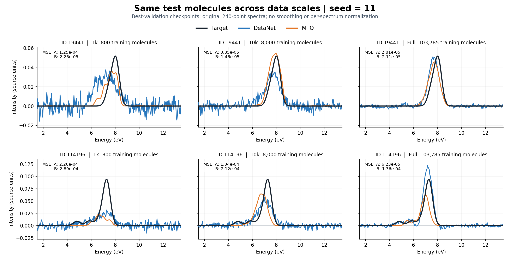
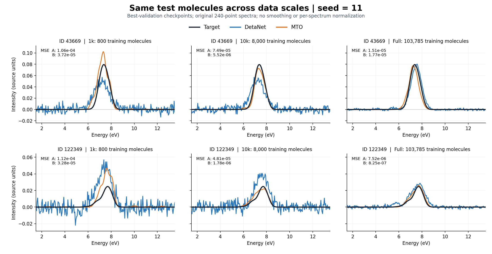

# 三规模最终结果分析

本文件基于本轮6次训练各自的最佳验证checkpoint测试结果。仅seed=11，无重训、无新增消融、无跨种子统计。

| 规模 | 模型 | 测试 MSE | 归一化 MSE | MAE | 余弦相似度 | 实际 / 最佳 epoch | 训练小时 |
|---|---|---:|---:|---:|---:|---:|---:|
| 1k | A：DetaNet | 0.000288303271 | 0.4777819 | 0.00926062 | 0.766021 | 1000 / 958 | 0.328 |
| 1k | B：MTO | 0.000258655432 | 0.4286489 | 0.00508280 | 0.836268 | 231 / 79 | 0.098 |
| 10k | A：DetaNet | 0.000294280873 | 0.4897009 | 0.00730541 | 0.841885 | 495 / 343 | 1.121 |
| 10k | B：MTO | 0.000201356699 | 0.3350696 | 0.00378979 | 0.905210 | 238 / 86 | 0.644 |
| full | A：DetaNet | 0.000111856695 | 0.1775715 | 0.00389380 | 0.930602 | 551 / 399 | 15.935 |
| full | B：MTO | 7.76070595e-05 | 0.1232005 | 0.00242126 | 0.947602 | 236 / 84 | 8.244 |

## 能支持的结论

在相同规模、相同划分与共同训练协议下，MTO三个规模的测试MSE均低于A：1k：10.28%；10k：31.58%；full：30.62%。MAE和平均余弦相似度也在三个规模下均更优。这说明优势延续到了本轮10k和全量设置；不能由一个种子推出跨种子稳定性或显著性。

1k的详细分析表明MTO较早过拟合，背景误差明显较低，但5–8 eV区间MSE、主峰位置和积分谱面积并未全面改善。该分析仅适用于1k，不能未经重新统计就套用于10k与全量。完整分布、能量区间与固定样例分析见[1k分析](audit/analysis_1k/ANALYSIS.md)。

## 收敛与实际成本

10k中A运行495轮、best=343；B运行238轮、best=86。全量中A运行551轮、best=399；B运行236轮、best=84。两规模均正常早停。B实际累计训练时间分别为0.644和8.244小时，A分别为1.121和15.935小时。较少的实际训练轮数带来流程成本节省，不能解释为MTO单步计算更快；作业使用不同计算节点，也不是受控吞吐性能测试。

## 同分子跨规模对照

四个分子沿用1k预先固定的测试列表，在三个规模中均属于测试集，且目标逐点一致。每行是同一分子、横向为1k/10k/full，纵轴范围相同，没有后处理平滑或逐谱归一化。它们不是按模型好坏挑选的成功案例。

- 19441：三个规模B的MSE都更低，但B在10k的个体误差低于全量，不能认为每个分子必然随数据量单调改善。
- 114196：三个规模均为B更差。全量A高估主峰，B低估且峰位偏移。
- 43669：10k时B更好；全量时两者接近真实谱，A的MSE略低。
- 122349：10k/full中B更准确，全量MSE约为A的1/9。

这些样例中A的背景波动随数据规模明显降低，B在小规模已有平滑背景，但仍可能有峰位/峰高误差。四个固定样例的胜负不代表全测试集胜率；总体结论以完整测试集指标为准。

## 比较口径

每个规模用本规模训练RMS²归一化，A/B完全共享，因此同一规模两种MSE的相对改善相同。不同规模的测试集和训练RMS不同，10k的A原始MSE略高于1k不能直接解释为增加训练数据使A退步。跨规模的个体变化可由上面的共同测试分子图直接观察，但这四个例子也不足以作全体配对统计结论。

所有模型均从头训练，各自以验证集选checkpoint。保存的best和last包括恢复所需状态；最终测试没有反过来选择epoch。源谱网格适配、未知展宽与MTO sigma=.2 eV假设保持原样。原始运行问题及编码修复均已记录，最终报告和完成标记由真实评估流程生成。
