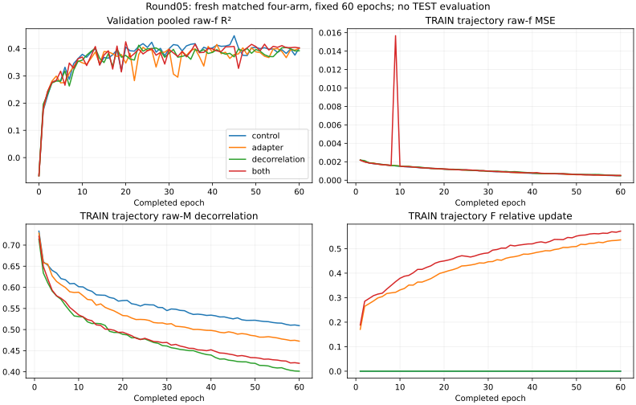

# Round05 — fresh MTO factorial on the audited QM9S v2 partition

**The original control is the strongest model in this round.** Its validation-selected epoch45 reaches pooled raw-f R² **0.447169**. Shared right-F, weak raw-state decorrelation and their combination all score lower. No noncontrol arm clears the frozen +0.003 threshold, so the 60-epoch pilot closes without extension or seed allocation. This conclusion concerns one matched initialization and this fixed recipe; it is not a proof that the architecture can never help.

All four runs completed 60 epochs and 112860 optimizer updates. Every validation evaluation includes 6686 molecules ×10 states =66860 valid raw printed-f labels, including zeros. There was no TEST evaluation, calibration, label exclusion or prediction averaging. The new partition is internally disjoint under audited identity rules, but historically exposed: its sealed TEST has5989 oldTRAIN,361 oldVAL and336 oldTEST molecules. Old-split incumbent scores are not comparable benchmark gains.

## Selected checkpoints

| Arm | Selected epoch | Pooled R² | ΔR² vs control | f RMSE | f MAE | Energy MAE (eV) |
| --- | --- | --- | --- | --- | --- | --- |
| control | 45 | 0.447169 | 0.000000 | 0.038091 | 0.017463 | 0.089163 |
| adapter | 41 | 0.415020 | -0.032149 | 0.039183 | 0.017942 | 0.090917 |
| decorrelation | 23 | 0.412399 | -0.034770 | 0.039271 | 0.018297 | 0.095236 |
| both | 20 | 0.424966 | -0.022203 | 0.038849 | 0.018837 | 0.098551 |

Checkpoint selection maximizes native pooled raw-f R² by minimizing SSE, including epoch0; strict ties retain the earliest epoch. Each row is one model and one checkpoint. The selection rule was frozen before fitting.

## Aligned epoch60 comparison

| Arm | R² at60 | ΔR² vs control60 | f RMSE | f MAE | Energy MAE (eV) |
| --- | --- | --- | --- | --- | --- |
| control | 0.402692 | 0.000000 | 0.039594 | 0.017578 | 0.086986 |
| adapter | 0.401178 | -0.001514 | 0.039644 | 0.017494 | 0.087854 |
| decorrelation | 0.392013 | -0.010678 | 0.039946 | 0.017635 | 0.086861 |
| both | 0.402391 | -0.000301 | 0.039604 | 0.017414 | 0.088853 |

The aligned factorial contrast R²(both)−R²(F)−R²(decor)+R²(control) is 0.011892. The independently selected-checkpoint contrast is 0.044716 and describes the complete selection procedures. Neither contrast demonstrates a physical synergy; all three selected ablations lose to control.

## Per-state errors

### Selected checkpoints

Each cell is R² / raw-f RMSE. Each state contains6686 labels.

| State | control | adapter | decorrelation | both |
| --- | --- | --- | --- | --- |
| S1 | 0.835427 / 0.018863 | 0.827684 / 0.019302 | 0.847691 / 0.018147 | 0.833705 / 0.018962 |
| S2 | 0.718956 / 0.027623 | 0.723420 / 0.027403 | 0.697797 / 0.028644 | 0.692059 / 0.028915 |
| S3 | 0.620348 / 0.029188 | 0.618085 / 0.029275 | 0.549487 / 0.031796 | 0.580687 / 0.030675 |
| S4 | 0.430883 / 0.034781 | 0.413224 / 0.035316 | 0.374241 / 0.036471 | 0.374748 / 0.036456 |
| S5 | 0.465484 / 0.035442 | 0.445139 / 0.036110 | 0.381210 / 0.038134 | 0.344265 / 0.039256 |
| S6 | 0.304689 / 0.038801 | 0.376036 / 0.036756 | 0.321290 / 0.038335 | 0.273126 / 0.039672 |
| S7 | 0.224684 / 0.043640 | 0.169613 / 0.045164 | 0.205901 / 0.044166 | 0.202740 / 0.044254 |
| S8 | 0.295518 / 0.044283 | 0.256290 / 0.045500 | 0.283957 / 0.044645 | 0.251542 / 0.045645 |
| S9 | 0.435649 / 0.052587 | 0.250724 / 0.060593 | 0.344728 / 0.056665 | 0.441689 / 0.052305 |
| S10 | 0.158797 / 0.044004 | 0.266279 / 0.041097 | 0.195167 / 0.043042 | 0.246665 / 0.041643 |

### Fixed epoch60

Each cell is R² / raw-f RMSE. Each state contains6686 labels.

| State | control | adapter | decorrelation | both |
| --- | --- | --- | --- | --- |
| S1 | 0.830618 / 0.019137 | 0.846745 / 0.018203 | 0.852418 / 0.017863 | 0.850710 / 0.017966 |
| S2 | 0.730557 / 0.027047 | 0.714023 / 0.027864 | 0.738512 / 0.026645 | 0.732254 / 0.026961 |
| S3 | 0.599718 / 0.029971 | 0.605785 / 0.029743 | 0.590835 / 0.030302 | 0.607142 / 0.029692 |
| S4 | 0.441697 / 0.034449 | 0.416846 / 0.035207 | 0.411698 / 0.035362 | 0.401864 / 0.035656 |
| S5 | 0.449443 / 0.035970 | 0.424718 / 0.036769 | 0.479199 / 0.034985 | 0.456694 / 0.035732 |
| S6 | 0.320939 / 0.038345 | 0.365126 / 0.037076 | 0.333798 / 0.037980 | 0.315392 / 0.038501 |
| S7 | 0.089850 / 0.047283 | 0.104036 / 0.046913 | 0.083538 / 0.047447 | 0.041162 / 0.048531 |
| S8 | 0.248558 / 0.045736 | 0.297911 / 0.044208 | 0.235893 / 0.046119 | 0.298193 / 0.044199 |
| S9 | 0.287746 / 0.059077 | 0.230233 / 0.061416 | 0.239259 / 0.061055 | 0.272165 / 0.059720 |
| S10 | 0.169243 / 0.043730 | 0.204654 / 0.042788 | 0.136784 / 0.044576 | 0.197400 / 0.042983 |

## Bright tails and false-bright predictions

Thresholds were fixed from the new TRAIN labels: q90=.0549 and q99=.2406. True-bright tails use target f at or above the threshold; they are diagnostics, not exclusions or alternate selection metrics.

| Policy | Arm | q90 count | q90 RMSE | q99 count | q99 RMSE | q99 MAE | q99 SSE |
| --- | --- | --- | --- | --- | --- | --- | --- |
| selected_best | control | 6782 | 0.098028 | 708 | 0.224982 | 0.164898 | 35.836775 |
| selected_best | adapter | 6782 | 0.097073 | 708 | 0.217590 | 0.155562 | 33.520432 |
| selected_best | decorrelation | 6782 | 0.102928 | 708 | 0.240335 | 0.182250 | 40.894570 |
| selected_best | both | 6782 | 0.100831 | 708 | 0.235415 | 0.179140 | 39.237481 |
| fixed60 | control | 6782 | 0.097674 | 708 | 0.227077 | 0.160905 | 36.507317 |
| fixed60 | adapter | 6782 | 0.098497 | 708 | 0.225547 | 0.160283 | 36.016974 |
| fixed60 | decorrelation | 6782 | 0.097621 | 708 | 0.223968 | 0.155525 | 35.514386 |
| fixed60 | both | 6782 | 0.098650 | 708 | 0.226657 | 0.158089 | 36.372496 |

The following four disjoint bins cover all66860 labels at q99; each cell is count / SSE. T and P denote target and prediction at or above q99.

| Policy | Arm | T0/P0 | T0/P1 false bright | T1/P0 missed bright | T1/P1 |
| --- | --- | --- | --- | --- | --- |
| selected_best | control | 66038 / 48.838653 | 114 / 12.334493 | 464 / 27.540235 | 244 / 8.296540 |
| selected_best | adapter | 66021 / 49.923322 | 131 / 19.207634 | 426 / 29.978258 | 282 / 3.542173 |
| selected_best | decorrelation | 66069 / 52.726174 | 83 / 9.490604 | 495 / 36.404555 | 213 / 4.490015 |
| selected_best | both | 66070 / 52.408102 | 82 / 9.260551 | 500 / 28.954111 | 208 / 10.283370 |
| fixed60 | control | 65999 / 49.428392 | 153 / 18.879056 | 447 / 32.804735 | 261 / 3.702582 |
| fixed60 | adapter | 66000 / 48.890242 | 152 / 20.173220 | 427 / 32.790746 | 281 / 3.226228 |
| fixed60 | decorrelation | 65963 / 49.065584 | 189 / 22.108635 | 402 / 31.385349 | 306 / 4.129037 |
| fixed60 | both | 65998 / 48.374564 | 154 / 20.120495 | 434 / 32.848876 | 274 / 3.523620 |

Tail changes are mixed. At selected checkpoints, F improves true-q99 RMSE versus control (.217590 vs .224982) while false-bright SSE rises (19.207634 vs12.334493), and pooled accuracy worsens. Decorrelation and both reduce selected false-bright SSE but have worse true-q99 RMSE. From their selected epochs to60, decorrelation and both improve true-q99 RMSE while false-bright SSE increases sharply and pooled R² falls. A single uniform tail-improvement or failure explanation is therefore unsupported.

## Optimization and representation diagnostics

TRAIN values below are weighted pre-update minibatch aggregates along each epoch, not fixed-checkpoint TRAIN evaluations. Validation uses completed checkpoints. Their differences cannot alone identify the cause of generalization error.

| Arm/epoch | TRAIN raw-f MSE | TRAIN LE | TRAIN Ls | VAL LE | VAL Ls | Raw-M penalty | Mean F/M change | Clip fraction |
| --- | --- | --- | --- | --- | --- | --- | --- | --- |
| control/1 | 0.002192 | 0.126671 | 0.236215 | 0.074139 | 0.226297 | 0.733023 | 0.000000 | 0.006380 |
| control/45 | 0.000699 | 0.023402 | 0.066400 | 0.028129 | 0.143425 | 0.525315 | 0.000000 | 0.001063 |
| control/60 | 0.000481 | 0.020198 | 0.044258 | 0.027629 | 0.153063 | 0.509309 | 0.000000 | 0.000000 |
| adapter/1 | 0.002179 | 0.124841 | 0.234576 | 0.078806 | 0.226627 | 0.728164 | 0.170692 | 0.005848 |
| adapter/41 | 0.000753 | 0.023971 | 0.071739 | 0.030026 | 0.149878 | 0.496411 | 0.484659 | 0.002127 |
| adapter/60 | 0.000503 | 0.020592 | 0.046435 | 0.029207 | 0.154142 | 0.472521 | 0.535609 | 0.001063 |
| decorrelation/1 | 0.002185 | 0.125868 | 0.235434 | 0.073780 | 0.220363 | 0.713934 | 0.000000 | 0.005848 |
| decorrelation/23 | 0.001170 | 0.029415 | 0.115871 | 0.031449 | 0.152448 | 0.480785 | 0.000000 | 0.003721 |
| decorrelation/60 | 0.000493 | 0.020550 | 0.045457 | 0.028020 | 0.155664 | 0.401419 | 0.000000 | 0.000000 |
| both/1 | 0.002177 | 0.125052 | 0.234178 | 0.074537 | 0.224527 | 0.720791 | 0.188221 | 0.005316 |
| both/20 | 0.001219 | 0.029772 | 0.120647 | 0.035692 | 0.149740 | 0.493738 | 0.449735 | 0.005848 |
| both/60 | 0.000521 | 0.020992 | 0.048411 | 0.030883 | 0.152253 | 0.420101 | 0.571315 | 0.000000 |

At epoch60, F changes the right-state representations by mean relative magnitudes .535609 (F) and .571315 (both): these adapters are active, not identity-stuck. The penalty decreases to .401419/.420101 with decorrelation, versus .509309 for control. Those feature changes do not establish physical state orthogonality, dipole adaptation, or improved generalization.

Every arm lowers TRAIN raw-f, energy and trace losses after its selected epoch, while validation raw-f R² falls. Validation energy loss improves slightly, but validation trace loss worsens. This is compatible with increasing fit to TRAIN and a mismatch between the training objective and pooled raw-f priorities. It does not establish either as the cause or distinguish them from seed variation. Gradient clipping is rare late in training, and there is no nonfinite or optimizer failure evidence. Extending the unchanged protocol is not supported by its frozen gate.

The largest669 state errors (top1%) contribute about53–57% of selected pooled SSE. Complete prediction/error quantiles and exact shares are in ROUND05_RESULTS.json; no rows are removed.

## Descriptive uncertainty

Paired bootstrap resamples all molecules within each of 5656 audited validation identity components, preserving their ten states. Seed20260930, 2000 draws, percentile2.5/97.5 intervals; each draw recomputes pooled target SST. This was a post-training descriptive analysis of already selected validation predictions. It does not correct checkpoint selection or reused validation, and is not independent-seed or fresh-holdout confirmation.

| Policy | Arm | ΔR² | Descriptive95% interval |
| --- | --- | --- | --- |
| selected_best | adapter | -0.032149 | [-0.078600, 0.007535] |
| selected_best | both | -0.022203 | [-0.050556, 0.001226] |
| selected_best | control | 0.000000 | [0.000000, 0.000000] |
| selected_best | decorrelation | -0.034770 | [-0.060140, -0.010734] |
| fixed60 | adapter | -0.001514 | [-0.023940, 0.019847] |
| fixed60 | both | -0.000301 | [-0.027389, 0.030727] |
| fixed60 | control | 0.000000 | [0.000000, 0.000000] |
| fixed60 | decorrelation | -0.010678 | [-0.040390, 0.016983] |

## Best verified recipe and private checkpoints

For this v2 split, retain the unchanged original PSD MTO control at epoch45: channels16, query32, router/head128; fresh seed11, independent order seed11, new TRAIN-only normalization; original LE+Ls; Adam AMSGrad LR.001 fixed, batch64, WD0, clip5, FP32/noAMP/noTF32. Validation selects epoch45 within the fixed60-epoch run. F is disabled and the penalty is zero. This is the strongest verified recipe in this round, not attainment of the target0.60.

Server prefix: `/home/inspur/MTO-1/research/single_model_20260929/round05_scratch_preparation/runs/`. Each geometry_best.pt is one self-contained geometry predictor. Full optimizer/RNG/order recovery remains in last.pt; best.pt is the selected training snapshot. No model, optimizer, prediction or split arrays are uploaded.

| Arm | Selected epoch | Geometry checkpoint relative path | SHA256 |
| --- | --- | --- | --- |
| control | 45 | control/geometry_best.pt | e71c63da8bb3b8214e014ca64946fecab97fbc210cb068c0b1a3eefa3bbf8f1e |
| adapter | 41 | adapter/geometry_best.pt | 3f1a89a8d3ea0a2ebc0d2d27805b4a1ed2282b1f674e28b6b6c5a6b07b96db6c |
| decorrelation | 23 | decorrelation/geometry_best.pt | 4261ca68cca693305c44ed00073d9890793436dad71f765752a022f093dc4cae |
| both | 20 | both/geometry_best.pt | 26fb828684167c491d5dcdbb7b25c3ec67ff0e8e482f0f421dac8fce2a4b9489 |

## Verification and reproduction

All82 frozen source/input bindings, exact authorization/publication references, four terminal receipts,60 prescribed order hashes per arm,61 history rows,112860 optimizer steps, full checkpoint/RNG metadata, earliest minimum-SSE selection, selected/final prediction hashes and decoder ledgers passed. The exported model tensors exactly equal each selected checkpoint. The terminal audit used CPU tensor reads and saved validation outputs only: no model construction, forward inference, raw-dataset target decoding or TEST access. The geometry buffer fingerprint was not reconstructed again; strict one-checkpoint loading/O(3) behavior was covered by the preserved technical preflight. Process absence/zombie is exit evidence, not an observed OS exit code.

Reproducible commands and fixed source/environment references are in ROUND05_REPRODUCE.md. terminal_analysis.py and its fixed analysis config reproduce aggregate metrics, component bootstrap and the SVG. ANALYSIS_RECEIPT.json binds every read input and output. The earlier CPU/GPU preflight failures, explicit CUDA parity amendment and I/O-only source continuity remain in the preparation archive. No outcome-dependent tolerance change occurred during fitting or terminal analysis.

## Decision boundary

The frozen +.003 noncontrol-over-control criterion fails. No extension, additional seed or TEST evaluation is authorized. Root decides any distinct next preparation after independent result review and D-first archival publication. A possible new objective comparison and the deferred QC congruence hypothesis are discussed separately; neither has been implemented or fitted by this analysis.
