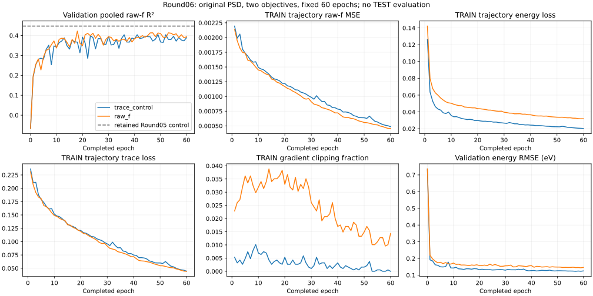

# Round06 — unchanged PSD MTO, trace versus native raw-f supervision

**The frozen promotion gate fails.** Raw-f supervision reaches selected validation pooled R² **0.422028**, above its contemporaneous trace control (**0.404798**) but below the retained Round05 reference (**0.447169**). The candidate does not clear +.003 over both comparators. No seed allocation, extension or TEST evaluation follows automatically. This is one matched-seed comparison, not proof that raw-f supervision cannot help under another justified protocol.

Both runs completed60 epochs and112,860 updates, with one original attempt and no failure or resume. Every validation score includes6,686 molecules ×10 states =66,860 valid printed raw-f labels, including zeros. No calibration, target exclusions, state permutation, prediction averaging or TEST inference was used. The v2 partition is internally disjoint under audited identity rules but historically exposed; its sealed TEST contains5,989 old-TRAIN,361 old-validation and336 old-TEST molecules. It is not external fresh confirmation.

## Selected checkpoints and retained reference

| Arm | Epoch | Pooled R² | ΔR² vs current control | f RMSE | f MAE | Energy MAE (eV) |
| --- | --- | --- | --- | --- | --- | --- |
| trace_control | 49 | 0.404798 | 0.000000 | 0.039524 | 0.017560 | 0.089017 |
| raw_f | 18 | 0.422028 | 0.017231 | 0.038948 | 0.018550 | 0.117380 |
| retained Round05 control | 45 | 0.447169 | previous reference | 0.038091 | 0.017463 | 0.089163 |

Candidate ΔR² is 0.017231 versus the current control and -0.025141 versus the retained reference. Its required retained-reference score was0.450169. Checkpoints were selected by earliest minimum pooled validation SSE across epochs0–60, with no test-driven choice. The retained row is a previously published aggregate on the same reused validation, not a new inference or model average.

## Fixed epoch60

| Arm | R² | ΔR² vs control60 | f RMSE | f MAE | Energy RMSE (eV) |
| --- | --- | --- | --- | --- | --- |
| trace_control | 0.389052 | 0.000000 | 0.040043 | 0.017805 | 0.125398 |
| raw_f | 0.393659 | 0.004607 | 0.039892 | 0.018055 | 0.146469 |

Aligned final-epoch results also remain below the retained reference. They are reported separately from independently selected checkpoints; the final epoch is not an alternative selection rule.

## Per-state errors

### Selected checkpoints

Each state has6,686 labels. Each cell is R² / raw-f RMSE / MAE.

| State | trace_control | raw_f |
| --- | --- | --- |
| S1 | 0.854929 / 0.017710 / 0.007825 | 0.784885 / 0.021566 / 0.009796 |
| S2 | 0.719676 / 0.027587 / 0.014312 | 0.697748 / 0.028646 / 0.016161 |
| S3 | 0.615479 / 0.029375 / 0.016217 | 0.548067 / 0.031846 / 0.018000 |
| S4 | 0.414498 / 0.035278 / 0.018274 | 0.359693 / 0.036892 / 0.019841 |
| S5 | 0.477733 / 0.035034 / 0.018798 | 0.375294 / 0.038316 / 0.019821 |
| S6 | 0.335231 / 0.037939 / 0.018782 | 0.299754 / 0.038938 / 0.020086 |
| S7 | -0.022202 / 0.050109 / 0.020453 | 0.230948 / 0.043464 / 0.020702 |
| S8 | 0.302204 / 0.044073 / 0.020198 | 0.352631 / 0.042450 / 0.020437 |
| S9 | 0.280468 / 0.059378 / 0.020915 | 0.386550 / 0.054827 / 0.020574 |
| S10 | 0.220865 / 0.042350 / 0.019826 | 0.206317 / 0.042743 / 0.020085 |

### Fixed epoch60

Each state has6,686 labels. Each cell is R² / raw-f RMSE / MAE.

| State | trace_control | raw_f |
| --- | --- | --- |
| S1 | 0.851066 / 0.017944 / 0.007802 | 0.828282 / 0.019268 / 0.008723 |
| S2 | 0.709643 / 0.028077 / 0.014489 | 0.723188 / 0.027414 / 0.014559 |
| S3 | 0.590712 / 0.030306 / 0.016437 | 0.575742 / 0.030855 / 0.016754 |
| S4 | 0.413825 / 0.035298 / 0.018398 | 0.379506 / 0.036317 / 0.018814 |
| S5 | 0.440837 / 0.036250 / 0.019193 | 0.386625 / 0.037967 / 0.019215 |
| S6 | 0.319685 / 0.038380 / 0.019111 | 0.293482 / 0.039112 / 0.019433 |
| S7 | 0.042623 / 0.048494 / 0.020545 | 0.071030 / 0.047769 / 0.021064 |
| S8 | 0.311797 / 0.043769 / 0.020466 | 0.269383 / 0.045097 / 0.020911 |
| S9 | 0.231681 / 0.061358 / 0.020986 | 0.308295 / 0.058219 / 0.020617 |
| S10 | 0.156939 / 0.044053 / 0.020622 | 0.199059 / 0.042938 / 0.020458 |

At selected checkpoints the candidate improves SSE for S7–S9, while S1–S6 and S10 worsen. Its pooled SSE improvement over the current control is therefore not a uniform state improvement. The state labels remain fixed; no root matching or selective exclusions were applied.

## Bright tails, false-bright predictions and error concentration

Thresholds are frozen from TRAIN: q90=.0549 and q99=.2406. True-tail rows are diagnostics and remain part of the pooled metric.

| Policy | Arm | q90 count | q90 RMSE | q99 count | q99 RMSE | q99 MAE | q99 SSE |
| --- | --- | --- | --- | --- | --- | --- | --- |
| selected_best | trace_control | 6782 | 0.099966 | 708 | 0.229575 | 0.163840 | 37.314995 |
| selected_best | raw_f | 6782 | 0.102896 | 708 | 0.238932 | 0.183651 | 40.418799 |
| fixed60 | trace_control | 6782 | 0.098455 | 708 | 0.225399 | 0.156231 | 35.969765 |
| fixed60 | raw_f | 6782 | 0.097577 | 708 | 0.225894 | 0.159040 | 36.127884 |

All four disjoint q99 target/prediction bins below sum to all66,860 labels and the full pooled SSE. Each cell is count / SSE.

| Policy | Arm | T0/P0 | T0/P1 false bright | T1/P0 missed bright | T1/P1 |
| --- | --- | --- | --- | --- | --- |
| selected_best | trace_control | 66037 / 49.322726 | 115 / 17.807549 | 431 / 33.400599 | 277 / 3.914396 |
| selected_best | raw_f | 66078 / 52.773388 | 74 / 8.229482 | 504 / 35.326527 | 204 / 5.092272 |
| fixed60 | trace_control | 65982 / 50.284578 | 170 / 20.953899 | 412 / 32.350355 | 296 / 3.619410 |
| fixed60 | raw_f | 65987 / 50.698949 | 165 / 19.572932 | 411 / 31.805217 | 297 / 4.322667 |

At selected checkpoints raw-f supervision reduces false-bright SSE from17.807549 to8.229482, while true-q99 RMSE worsens from.229575 to.238932, pooled MAE rises and energy MAE rises. From its selected epoch18 to60, the raw-f arm improves true-q99 RMSE to.225894 but false-bright SSE rises to19.572932 and pooled R² falls. The aggregate evidence supports this tradeoff; it does not identify a physical mechanism.

| Policy | Arm | Top1% count | Top1% SSE share | Prediction q99 | Prediction max | Absolute error q99 | Absolute error max |
| --- | --- | --- | --- | --- | --- | --- | --- |
| selected_best | trace_control | 669 | 0.589623 | 0.190366 | 2.892905 | 0.154835 | 2.454100 |
| selected_best | raw_f | 669 | 0.526221 | 0.162296 | 1.892329 | 0.158444 | 2.487904 |
| fixed60 | trace_control | 669 | 0.590978 | 0.209180 | 2.620807 | 0.158313 | 2.473458 |
| fixed60 | raw_f | 669 | 0.578178 | 0.203893 | 2.557715 | 0.157752 | 2.491058 |

These tail summaries retain every row. Complete quantiles, per-state SSE and all aggregate arithmetic are in ROUND06_RESULTS.json.

## TRAIN trajectories, clipping and energy coupling

TRAIN values are weighted pre-update minibatch aggregates along an epoch, not fixed-checkpoint TRAIN evaluations. Validation is evaluated at completed checkpoints. TRAIN total is LE+Ls or LE+Lf as assigned; TRAIN base and validation base_objective remain LE+Ls in both arms. FP32 normalized training Lf is distinct from the FP64 native-f MSE diagnostic.

| Arm/epoch | TRAIN raw-f MSE | TRAIN LE | TRAIN Ls | TRAIN Lf | VAL LE | VAL Ls | Clip fraction |
| --- | --- | --- | --- | --- | --- | --- | --- |
| trace_control/1 | 0.002195 | 0.126415 | 0.236343 | 0.874672 | 0.068138 | 0.222902 | 0.005316 |
| trace_control/49 | 0.000639 | 0.022362 | 0.059969 | 0.254803 | 0.029143 | 0.152134 | 0.001595 |
| trace_control/60 | 0.000486 | 0.020286 | 0.044692 | 0.193705 | 0.029245 | 0.156333 | 0.000000 |
| raw_f/1 | 0.002139 | 0.142131 | 0.231055 | 0.852725 | 0.089454 | 0.220506 | 0.022860 |
| raw_f/18 | 0.001226 | 0.044823 | 0.124558 | 0.488713 | 0.047170 | 0.152385 | 0.036151 |
| raw_f/60 | 0.000456 | 0.031877 | 0.044361 | 0.181815 | 0.039899 | 0.157552 | 0.014354 |

Both arms reduce TRAIN raw-f, energy and trace losses after their selected checkpoints while validation pooled raw-f performance worsens. The raw-f arm also improves validation energy error after epoch18, but remains worse than trace control at60. Its clipping fraction remains1.44% at60 versus0 for control. These observations are consistent with growing TRAIN fit and changing tail errors, but do not isolate objective mismatch, optimization instability or a generalization cause. No nonfinite/optimizer failure occurred, and the protocol was not extended.

The preparation fixture measured raw-f intensity-gradient norm6.7829 times trace-intensity norm with fixed coefficient1; that does not establish equal task weighting. Both predicted E and A receive raw-f gradients. The original PSD/softplus model and normalization remain unchanged. Dormant F movement stays zero; raw-M diagnostics do not enter either objective.

## Control repeat context and descriptive uncertainty

The retained Round05 control scored0.447169, while this control scored0.404798: an observed difference of−0.042372 with matching scientific recipe, initial tensors, order, optimizer, physical GPU1 and environment. Execution was not byte-identical: the earlier control built an orthogonality graph and added0×its loss, while this control logs that diagnostic without gradients and computes unused Lf diagnostics; earlier concurrency was four fits versus two here. See CONTROL_REPEAT_CONTEXT.md. These facts do not isolate the cause of the difference or establish seed robustness. The dual-reference gate prevents promoting a candidate solely against a weaker rerun.

Paired bootstrap resamples complete validation identity components (5656 groups,6,686 molecules, all ten states), seed20260930, 2000 draws, recomputing pooled SST in each draw. Percentile2.5/97.5 intervals below are descriptive and conditional on checkpoint selection/reused validation. They are not independent-seed confirmation or correction for model selection. No interval is computed against the aggregate-only retained reference.

| Policy | Candidate ΔR² vs current control | Descriptive95% interval |
| --- | --- | --- |
| selected_best | 0.017231 | [-0.028419, 0.070108] |
| fixed60 | 0.004607 | [-0.029977, 0.039243] |

Both intervals include zero. No robust or causal superiority claim follows from the positive point differences.

## Recipe and server checkpoints

The strongest retained v2 checkpoint remains the Round05 original control at epoch45, pooled validation R².44716940136585204. Recipe: original PSD MTO16/query32/router128/head128, fresh seed/order11, TRAIN-only normalization, LE+Ls, Adam AMSGrad fixedLR.001/batch64/WD0/clip5, FP32/noAMP/noTF32, selected within60 epochs. This round creates no stronger verified recipe and does not reach0.60.

Retained standalone checkpoint: `/home/inspur/MTO-1/research/single_model_20260929/round05_scratch_preparation/runs/control/geometry_best.pt`, SHA256 `e71c63da8bb3b8214e014ca64946fecab97fbc210cb068c0b1a3eefa3bbf8f1e`.

Round06 private prefix: `/home/inspur/MTO-1/research/single_model_20260929/round06_objective_preparation/runs/`. Each listed geometry export is one model/checkpoint with embedded config and TRAIN statistics; no prediction averaging or unavailable QC inputs. Full recovery is in last.pt, selected training snapshots in best.pt.

| Arm | Selected epoch | Geometry checkpoint relative path | SHA256 |
| --- | --- | --- | --- |
| trace_control | 49 | trace_control/geometry_best.pt | 7d3105fd3e32789baafb3c7cb8f63880a8928dd28d1d3bf04db2c1cc2cef2a61 |
| raw_f | 18 | raw_f/geometry_best.pt | cb8d8e82edff74a45b64293d1b03537df0f2b75037b96e45e417e1e904ca7e29 |

| Arm | Measured training+validation hours |
| --- | --- |
| trace_control | 2.596752 |
| raw_f | 2.617781 |

## Verification, reproduction and decision boundary

All134 frozen source bindings, exact authorization/review/publication references, two terminal receipts, all60 prescribed orders,61 history rows per arm,112,860 steps, complete checkpoint/optimizer/RNG metadata, earliest minimum-SSE selection, selected/final prediction hashes and partition ledgers passed. Exported model tensors equal the selected checkpoints exactly. The stored buffer fingerprint is present and syntactically valid; it was not reconstructed again. Strict loading and geometry forward access were verified during preserved preflight. Process absence/zombie is exit evidence, not an observed OS exit code.

Terminal analysis ran once on CPU with saved validation arrays and checkpoint payloads only: no model construction, model forward, raw-dataset targets or TEST access. The report renderer reads aggregate JSON only. Reproducible commands/source/environment references are in ROUND06_REPRODUCE.md. ANALYSIS_RECEIPT.json binds all inputs/outputs; private hashes are provenance references, never archive payloads. Preserve the preparation missing-mirror event and independent metadata-checker repair from the published preparation. No fitting/analysis tolerance or scientific setting changed after outcomes.

The frozen dual gate fails; no extension or seed allocation is authorized. Root decides any distinct next preparation after independent result review and D-first archival publication. The deferred shared-PSD congruence assessment is separate and authorizes no implementation, fit or TEST evaluation.

