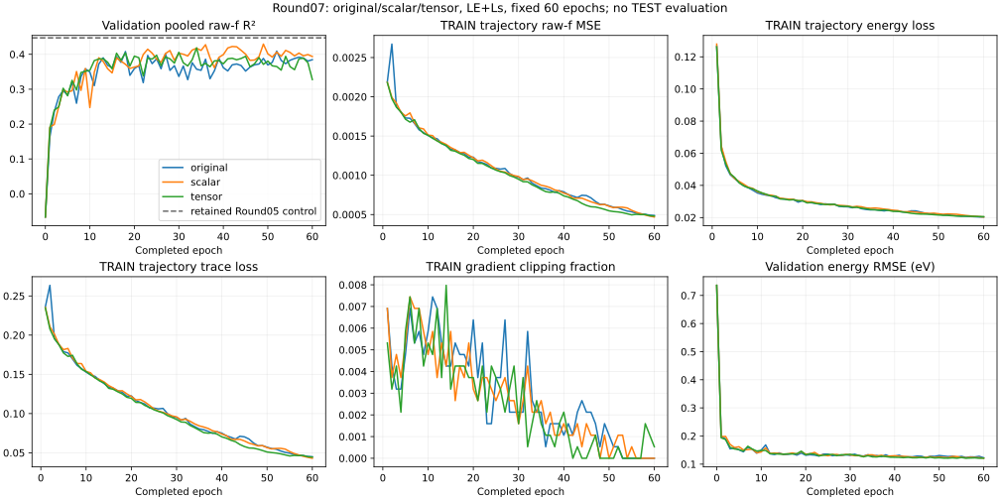
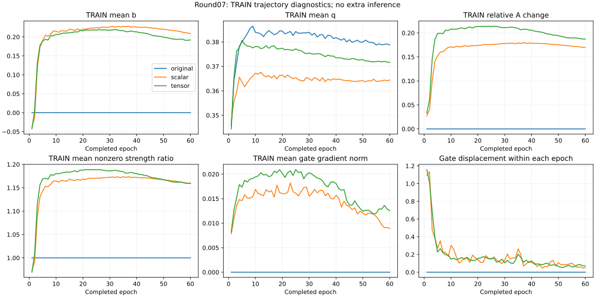

# Round07 — shared PSD context does not clear the controls

**The frozen tensor promotion gate fails.** Selected validation pooled raw-f R² is **0.409104 original**, **0.429339 scalar** and **0.418755 tensor**. The scalar control is strongest in this round, while the retained Round05 reference remains higher at **0.447169**. No new best verified recipe or progress to 0.60 is established.

All three runs completed 60 epochs and 112,860 updates with one original attempt each, no failure and no resume. Every validation score retains 6,686 molecules × 10 states = 66,860 printed raw-f labels, including zeros. Checkpoints use earliest minimum pooled native validation SSE across epochs 0–60. No calibration, exclusion, label permutation, averaging or TEST inference was used.

## Selected checkpoints and retained reference

| Arm | Epoch | Pooled R² | ΔR² vs original | f RMSE | f MAE | Energy MAE (eV) |
| --- | --- | --- | --- | --- | --- | --- |
| original | 52 | 0.409104 | 0.000000 | 0.039381 | 0.017359 | 0.088554 |
| scalar | 49 | 0.429339 | 0.020235 | 0.038701 | 0.017606 | 0.089930 |
| tensor | 34 | 0.418755 | 0.009651 | 0.039058 | 0.018564 | 0.095942 |
| retained Round05 control | 45 | 0.447169 | prior reference | 0.038091 | 0.017463 | 0.089163 |

Tensor ΔR² is 0.009651 versus original, -0.010584 versus scalar and -0.028414 versus retained. It needed at least +.003 against EACH comparator. The scalar control improves 0.020235 over its contemporary original, but remains -0.017830 below the retained reference. Preserve this control result descriptively; it grants no tensor claim or automatic scalar-specific allocation.

## Fixed epoch 60

| Arm | Pooled R² | f RMSE | f MAE | Energy RMSE (eV) |
| --- | --- | --- | --- | --- |
| original | 0.384533 | 0.040191 | 0.017766 | 0.122574 |
| scalar | 0.393775 | 0.039888 | 0.017679 | 0.121139 |
| tensor | 0.327777 | 0.042004 | 0.017791 | 0.121156 |

Tensor falls to 0.327777 at epoch 60, below original 0.384533 and scalar 0.393775. These aligned outcomes are separate from independently selected checkpoints, not an alternative selector. No extension or post hoc budget change follows.

## Per-state errors

### Selected checkpoints

Each state has 6,686 labels. Cells show R² / raw-f RMSE / MAE.

| State | original | scalar | tensor |
| --- | --- | --- | --- |
| S1 | 0.842471 / 0.018455 / 0.007795 | 0.847653 / 0.018149 / 0.008032 | 0.830360 / 0.019151 / 0.008788 |
| S2 | 0.739145 / 0.026612 / 0.014058 | 0.733519 / 0.026898 / 0.014088 | 0.701366 / 0.028474 / 0.015629 |
| S3 | 0.610195 / 0.029576 / 0.016037 | 0.606901 / 0.029701 / 0.016209 | 0.570801 / 0.031035 / 0.017895 |
| S4 | 0.392935 / 0.035922 / 0.018139 | 0.425955 / 0.034931 / 0.018321 | 0.397276 / 0.035793 / 0.019583 |
| S5 | 0.404955 / 0.037395 / 0.018688 | 0.428884 / 0.036636 / 0.019020 | 0.436725 / 0.036383 / 0.019382 |
| S6 | 0.382395 / 0.036569 / 0.018261 | 0.347884 / 0.037576 / 0.018882 | 0.347776 / 0.037580 / 0.019605 |
| S7 | 0.115402 / 0.046615 / 0.020315 | 0.154786 / 0.045565 / 0.020613 | 0.202942 / 0.044248 / 0.021410 |
| S8 | 0.268633 / 0.045121 / 0.020336 | 0.323953 / 0.043381 / 0.020182 | 0.311599 / 0.043775 / 0.021036 |
| S9 | 0.257909 / 0.060302 / 0.020350 | 0.309183 / 0.058181 / 0.020718 | 0.284124 / 0.059227 / 0.021780 |
| S10 | 0.255487 / 0.041398 / 0.019613 | 0.250647 / 0.041532 / 0.019993 | 0.254805 / 0.041417 / 0.020531 |

### Fixed epoch 60

Each state has 6,686 labels. Cells show R² / raw-f RMSE / MAE.

| State | original | scalar | tensor |
| --- | --- | --- | --- |
| S1 | 0.839965 / 0.018601 / 0.007829 | 0.853191 / 0.017816 / 0.007918 | 0.860591 / 0.017361 / 0.007754 |
| S2 | 0.718365 / 0.027652 / 0.014132 | 0.724362 / 0.027356 / 0.013926 | 0.732676 / 0.026940 / 0.014127 |
| S3 | 0.593537 / 0.030201 / 0.016196 | 0.602739 / 0.029858 / 0.016323 | 0.553790 / 0.031644 / 0.016320 |
| S4 | 0.412520 / 0.035337 / 0.018399 | 0.410840 / 0.035388 / 0.018641 | 0.357518 / 0.036955 / 0.018879 |
| S5 | 0.442896 / 0.036183 / 0.019166 | 0.424225 / 0.036785 / 0.019051 | 0.431250 / 0.036560 / 0.018717 |
| S6 | 0.385096 / 0.036489 / 0.018677 | 0.297516 / 0.039001 / 0.019071 | 0.248193 / 0.040347 / 0.019186 |
| S7 | 0.036251 / 0.048655 / 0.020921 | 0.089565 / 0.047290 / 0.020206 | -0.057406 / 0.050965 / 0.020739 |
| S8 | 0.276677 / 0.044872 / 0.021012 | 0.287720 / 0.044528 / 0.020557 | 0.184942 / 0.047632 / 0.021127 |
| S9 | 0.188315 / 0.063066 / 0.020923 | 0.231322 / 0.061373 / 0.020755 | 0.086895 / 0.066890 / 0.020712 |
| S10 | 0.181961 / 0.043394 / 0.020408 | 0.200066 / 0.042911 / 0.020340 | 0.155557 / 0.044089 / 0.020345 |

Selected scalar has lower SSE than the contemporary original on S1, S4, S5, S7, S8, S9. All other states remain in every pooled comparison.
Selected tensor has lower SSE than the contemporary original on S4, S5, S7, S8, S9. All other states remain in every pooled comparison.

## Bright tails, false-bright errors and concentration

TRAIN thresholds remain q90=.0549 and q99=.2406. True-tail diagnostics do not exclude other rows from pooled metrics.

| Policy | Arm | Tail | Count | RMSE | MAE | SSE |
| --- | --- | --- | --- | --- | --- | --- |
| selected_best | original | q90 | 6782 | 0.100877 | 0.068460 | 69.014172 |
| selected_best | original | q99 | 708 | 0.233660 | 0.167927 | 38.654753 |
| selected_best | scalar | q90 | 6782 | 0.097254 | 0.066416 | 64.146460 |
| selected_best | scalar | q99 | 708 | 0.221826 | 0.156209 | 34.838315 |
| selected_best | tensor | q90 | 6782 | 0.099644 | 0.067710 | 67.337988 |
| selected_best | tensor | q99 | 708 | 0.235848 | 0.172710 | 39.382070 |
| fixed60 | original | q90 | 6782 | 0.099018 | 0.066698 | 66.495189 |
| fixed60 | original | q99 | 708 | 0.228615 | 0.163598 | 37.003373 |
| fixed60 | scalar | q90 | 6782 | 0.097024 | 0.065222 | 63.843478 |
| fixed60 | scalar | q99 | 708 | 0.220093 | 0.153736 | 34.296256 |
| fixed60 | tensor | q90 | 6782 | 0.100022 | 0.065982 | 67.849923 |
| fixed60 | tensor | q99 | 708 | 0.233048 | 0.159698 | 38.452392 |

The four disjoint true/predicted q99 bins sum to all 66,860 labels and total SSE. Cells show count / SSE. Bin membership depends on each model's predictions; changes are descriptive error decompositions, not causal effects on a fixed subgroup.

| Policy | Arm | T0/P0 | T0/P1 false bright | T1/P0 missed bright | T1/P1 |
| --- | --- | --- | --- | --- | --- |
| selected_best | original | 66040 / 49.315991 | 112 / 15.718826 | 452 / 34.542080 | 256 / 4.112672 |
| selected_best | scalar | 66012 / 49.485227 | 140 / 15.815230 | 423 / 29.733148 | 285 / 5.105167 |
| selected_best | tensor | 66031 / 50.153335 | 121 / 12.460604 | 470 / 32.953839 | 238 / 6.428231 |
| fixed60 | original | 66015 / 49.862801 | 137 / 21.135052 | 442 / 32.980065 | 266 / 4.023308 |
| fixed60 | scalar | 65983 / 50.463889 | 169 / 21.619312 | 401 / 30.020742 | 307 / 4.275514 |
| fixed60 | tensor | 65953 / 50.551097 | 199 / 28.957296 | 405 / 34.263093 | 303 / 4.189300 |

Selected scalar improves true-q99 RMSE to .221826 versus original .233660, while pooled MAE and energy MAE are slightly worse. Selected tensor reduces false-bright SSE to 12.460604 versus original 15.718826, but has worse q99 RMSE, pooled MAE and energy MAE. By epoch 60 tensor false-bright SSE grows to 28.957296; its slightly improved true-q99 RMSE does not offset deterioration elsewhere. This is an observed error tradeoff, not evidence of a QC mechanism.

| Policy | Arm | Top 1% count | Top 1% SSE share | Prediction q99 | Prediction max | Abs. error q99 | Abs. error max |
| --- | --- | --- | --- | --- | --- | --- | --- |
| selected_best | original | 669 | 0.582111 | 0.186089 | 2.896138 | 0.157268 | 2.444701 |
| selected_best | scalar | 669 | 0.563439 | 0.193795 | 3.438701 | 0.153305 | 2.397825 |
| selected_best | tensor | 669 | 0.554696 | 0.181715 | 2.839357 | 0.152828 | 2.383332 |
| fixed60 | original | 669 | 0.592565 | 0.195888 | 2.653430 | 0.155679 | 2.652830 |
| fixed60 | scalar | 669 | 0.583242 | 0.208844 | 2.965545 | 0.157403 | 2.487913 |
| fixed60 | tensor | 669 | 0.621293 | 0.212879 | 3.330444 | 0.158880 | 3.033134 |

All metrics, additional quantiles and per-state SSE remain in ROUND07_RESULTS.json. No high-error row was removed.

## TRAIN and gate trajectories

TRAIN entries are weighted pre-update minibatch aggregates, not fixed-checkpoint TRAIN evaluations. All arms optimize original LE+Ls; decorrelation and native raw-f MSE are diagnostics only. Validation is evaluated on the completed checkpoint. The following comparisons therefore describe trajectories, not a precisely matched TRAIN/validation generalization gap.

| Arm/epoch | TRAIN f MSE | TRAIN LE | TRAIN Ls | VAL LE | VAL Ls | Clip fraction |
| --- | --- | --- | --- | --- | --- | --- |
| original/1 | 0.002193 | 0.126611 | 0.236162 | 0.074575 | 0.229318 | 0.006911 |
| original/52 | 0.000587 | 0.021770 | 0.054586 | 0.030021 | 0.151608 | 0.000532 |
| original/60 | 0.000488 | 0.020351 | 0.044886 | 0.027943 | 0.157482 | 0.000000 |
| scalar/1 | 0.002183 | 0.127904 | 0.235229 | 0.072837 | 0.221994 | 0.006911 |
| scalar/49 | 0.000629 | 0.022730 | 0.059098 | 0.028530 | 0.145945 | 0.001063 |
| scalar/60 | 0.000469 | 0.020372 | 0.042974 | 0.027292 | 0.154898 | 0.000000 |
| tensor/1 | 0.002181 | 0.126204 | 0.234643 | 0.069816 | 0.221363 | 0.005316 |
| tensor/34 | 0.000852 | 0.025512 | 0.081969 | 0.031398 | 0.150693 | 0.002658 |
| tensor/60 | 0.000481 | 0.020589 | 0.044509 | 0.027300 | 0.171348 | 0.000532 |

All arms reduce TRAIN f, energy and trace losses between their selected and final epochs while validation pooled R² declines. Tensor TRAIN f MSE falls from .000852 at epoch 34 to .000481 at 60, while validation R² falls from .418755 to .327777. Energy MAE improves over that interval and false-bright error grows. No nonfinite or optimizer failure was recorded; these observations do not isolate generalization, representation or optimization as a cause.

| Arm/epoch | Mean b | Mean q | Relative A change | Mean strength ratio | Gate grad norm | Gate displacement in epoch |
| --- | --- | --- | --- | --- | --- | --- |
| original/1 | 0.000000 | 0.345592 | 0.000000 | 1.000000 | 0.000000 | 0.000000 |
| original/52 | 0.000000 | 0.380015 | 0.000000 | 1.000000 | 0.000000 | 0.000000 |
| original/60 | 0.000000 | 0.378747 | 0.000000 | 1.000000 | 0.000000 | 0.000000 |
| scalar/1 | -0.038301 | 0.347451 | 0.027056 | 0.973351 | 0.007834 | 1.092244 |
| scalar/49 | 0.220702 | 0.364103 | 0.175716 | 1.167672 | 0.012459 | 0.070448 |
| scalar/60 | 0.208875 | 0.364403 | 0.169794 | 1.158820 | 0.008950 | 0.051224 |
| tensor/1 | -0.042678 | 0.344442 | 0.032939 | 0.969339 | 0.008204 | 1.159457 |
| tensor/34 | 0.216792 | 0.375184 | 0.210697 | 1.185310 | 0.019067 | 0.135536 |
| tensor/60 | 0.192009 | 0.371613 | 0.187143 | 1.160004 | 0.012544 | 0.070579 |

The modified gates learned nonzero transformations: selected TRAIN mean relative A change is about .176 scalar and .211 tensor; gradients are live, and mean q exceeds the isotropic value 1/3. Thus the negative result is not explained by an identically inactive readout. These are logged latent-feature diagnostics, not physical orientation estimates. Strength ratios compare each model with its own incoming A, not with the other model. Gate displacement is within each epoch, not distance from initialization. Extreme b_min/max near ±.25 do not establish how often the gate saturates.

E is unchanged by the output transform, but predicted E enters both modified gates differentiably. Energy-error differences cannot be assigned solely to directional tensor context. At fixed incoming A, the transform preserves rank and cannot revive a zero tensor; the base is fully trainable. The scalar and tensor arms match gate inputs/177 active parameters/perturbation norm, not their full function classes. No identified transition density, TDDFT response, oscillator sum rule or polarization mechanism is claimed.

## Descriptive uncertainty and repeated-control context

Paired bootstrap uses 5656 validation identity components, all 6,686 molecules and ten states, seed 20260930, 2000 draws, and recomputed pooled SST. Intervals are conditional on selected checkpoints/reused validation and do not account for seed variability or selection. No paired interval is computed against the aggregate-only retained reference.

| Policy | Contrast | ΔR² | Descriptive 95% interval |
| --- | --- | --- | --- |
| selected_best | scalar_minus_original | 0.020235 | [-0.008953, 0.048984] |
| selected_best | tensor_minus_original | 0.009651 | [-0.017668, 0.033066] |
| selected_best | tensor_minus_scalar | -0.010584 | [-0.035256, 0.014707] |
| fixed60 | scalar_minus_original | 0.009242 | [-0.018770, 0.038369] |
| fixed60 | tensor_minus_original | -0.056757 | [-0.095654, -0.018434] |
| fixed60 | tensor_minus_scalar | -0.065999 | [-0.120878, -0.018998] |

All selected-checkpoint contrast intervals include zero. At fixed60, tensor-minus-original and tensor-minus-scalar intervals are negative; these remain descriptive validation comparisons, not fresh or independent-seed confirmation.

The current original control scores .409104, while earlier matched-declared-recipe controls scored .447169 (Round05) and .404798 (Round06). Initial base tensors, TRAIN order and core settings match; executable graphs, diagnostics, schema and concurrency differ. Round07 adds a dormant gate and its no-gradient diagnostics in the original arm. These observations do not isolate the source of repeat variability or establish an architecture ceiling. The retained-reference gate prevents promotion solely against a weaker rerun.

## Recipe, checkpoint locations and verification

The strongest retained v2 single checkpoint remains Round05 original control epoch45, validation R² .44716940136585204. Recipe: original PSD MTO16/query32/router128/head128, fresh seed/order11, TRAIN-only statistics, LE+Ls, Adam AMSGrad fixed LR .001/batch64/WD0/clip5, FP32 without AMP/TF32, selected within60 epochs. This round creates no stronger verified recipe. The .60 goal is unachieved.

Retained server artifact: `/home/inspur/MTO-1/research/single_model_20260929/round05_scratch_preparation/runs/control/geometry_best.pt`, SHA256 `e71c63da8bb3b8214e014ca64946fecab97fbc210cb068c0b1a3eefa3bbf8f1e`.

Round07 prefix: `/home/inspur/MTO-1/research/single_model_20260929/round07_congruence_preparation/runs/`. Every geometry export contains one full model plus its mode, transform contract, config and TRAIN statistics. No unavailable QC label or prediction averaging is needed.

| Arm | Epoch | Standalone relative path | SHA256 |
| --- | --- | --- | --- |
| original | 52 | original/geometry_best.pt | 4140329c1bbd121bfe2db8bac4b053f09aebd14c9808f13f56543f89a7d95b51 |
| scalar | 49 | scalar/geometry_best.pt | 46e7754c66ae995d3ab860366b2b08fa98e0deb025405954f3812a55ae9bddae |
| tensor | 34 | tensor/geometry_best.pt | 18d3b15914fa34b217ac46a0a5a5b5691ddde808450f9a706791fa80d0b363b4 |

| Arm | Measured training + validation hours |
| --- | --- |
| original | 2.828095 |
| scalar | 2.981976 |
| tensor | 2.821221 |

All185 frozen source pins, authorization/review/publication references, three normal terminal receipts,60 prescribed orders,61 history rows,112,860 steps, optimizer/RNG metadata, selection and saved-array hashes passed. Selected export tensors exactly equal each selected training snapshot; mode/transform contract and stored buffer fingerprints are checked. No new model reconstruction or forward replay was done; strict geometry loading was verified in preparation. Original gate matches its initial hash and the disabled F state is identical across all selected/final checkpoints.

The saved-output analysis ran once on CPU: six validation prediction sets, CPU checkpoint payloads, validation identity metadata and the published retained aggregate. It constructed no model and opened no raw dataset target or TEST array. Process absence/zombie is exit evidence, not an observed child OS exit code. The report renderer reads aggregate JSON only. Reproduction and recovery boundaries are in ROUND07_REPRODUCE.md; ANALYSIS_RECEIPT.json binds source/input/output hashes.

The v2 partition is disjoint under audited conservative identity rules but historically exposed: its TEST contains5,989 old-TRAIN/361 old-validation/336 old-TEST molecules. It is not external fresh confirmation. TEST remains sealed, and no labels were swapped, merged or excluded.

## Decision boundary

The frozen triple gate fails. Retain the stronger prior reference and preserve the scalar control as this round's best contemporary result. No seed allocation, extension, tensor-bound change or extra fit follows automatically. Root owns closeout and any distinct next proposal after independent review and D-first archival publication. NEXT_RESEARCH_QUESTION.md recommends a read-only audit of the original representation and optimization history before another pilot; it authorizes no computation or implementation.

