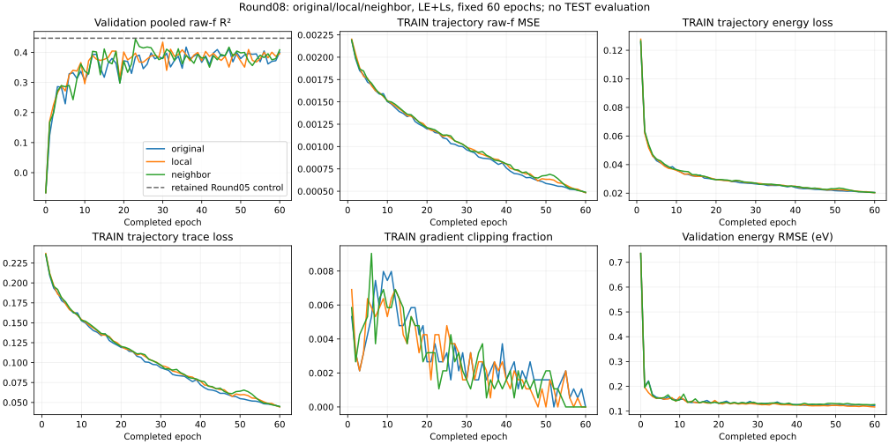
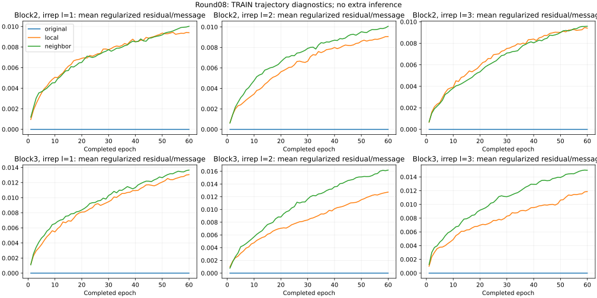

# Round08 — neighbor transport improves the paired controls but fails promotion

**The frozen triple promotion gate fails.** Selected validation pooled raw-f R² is **.417636 original**, **.433924 local** and **.443968 neighbor**. Neighbor exceeds both current controls but remains below the retained Round05 reference **.447169**. No new best verified recipe or achievement of the .60 target is established.

All three runs completed 60 epochs and 112,860 updates with one original attempt each, no failure and no resume. Every validation score retains 6,686 molecules × 10 states = 66,860 printed raw-f labels, including zeros. Earliest minimum pooled native validation SSE selects across epochs 0–60. No calibration, exclusions, label permutation, averaging or TEST inference was used.

## Selected checkpoints

| Arm | Epoch | Pooled R² | f RMSE | f MAE | Energy MAE (eV) | Energy RMSE (eV) |
| --- | --- | --- | --- | --- | --- | --- |
| original | 36 | 0.417636 | 0.039095 | 0.017886 | 0.092151 | 0.129748 |
| local | 30 | 0.433924 | 0.038545 | 0.018282 | 0.095561 | 0.128260 |
| neighbor | 23 | 0.443968 | 0.038201 | 0.018317 | 0.097017 | 0.131651 |
| retained Round05 control | 45 | 0.447169 | 0.038091 | 0.017463 | 0.089163 | 0.122983 |

Neighbor ΔR² is 0.026332 versus original, 0.010045 versus local and -0.003201 versus retained. Each comparison required at least +.003. The local control gains .016287 over this round's original but remains .013246 below retained. Preserve these paired gains descriptively; they authorize no scale change, extension or confirmation seeds.

## Fixed epoch 60

| Arm | Pooled R² | f RMSE | f MAE | Energy MAE (eV) | Energy RMSE (eV) |
| --- | --- | --- | --- | --- | --- |
| original | 0.400705 | 0.039660 | 0.017535 | 0.086998 | 0.122748 |
| local | 0.395837 | 0.039820 | 0.017528 | 0.086341 | 0.116946 |
| neighbor | 0.408616 | 0.039397 | 0.017621 | 0.087868 | 0.126482 |

Neighbor remains above the current controls at the aligned final epoch. All arms fall below their selected checkpoints. This is a separate fixed-budget comparison, not a replacement selector or reason to extend training.

## Per-state errors

### Selected checkpoints

Each state has 6,686 labels. Cells show R² / raw-f RMSE / MAE.

| State | original | local | neighbor |
| --- | --- | --- | --- |
| S1 | 0.845526 / 0.018275 / 0.008233 | 0.836780 / 0.018785 / 0.008525 | 0.843094 / 0.018418 / 0.008712 |
| S2 | 0.716913 / 0.027723 / 0.014845 | 0.709011 / 0.028107 / 0.015228 | 0.694485 / 0.028800 / 0.015903 |
| S3 | 0.602477 / 0.029867 / 0.016780 | 0.596812 / 0.030079 / 0.017228 | 0.572857 / 0.030960 / 0.017566 |
| S4 | 0.429971 / 0.034809 / 0.018620 | 0.398193 / 0.035766 / 0.019394 | 0.418679 / 0.035152 / 0.019646 |
| S5 | 0.433783 / 0.036478 / 0.019044 | 0.412925 / 0.037144 / 0.019690 | 0.370095 / 0.038475 / 0.019763 |
| S6 | 0.321284 / 0.038335 / 0.019220 | 0.344359 / 0.037678 / 0.019588 | 0.332235 / 0.038025 / 0.019424 |
| S7 | 0.110660 / 0.046739 / 0.020453 | 0.104111 / 0.046911 / 0.020877 | 0.253071 / 0.042834 / 0.020714 |
| S8 | 0.265318 / 0.045223 / 0.020890 | 0.292005 / 0.044394 / 0.020842 | 0.292999 / 0.044363 / 0.020802 |
| S9 | 0.358188 / 0.056080 / 0.020572 | 0.415592 / 0.053513 / 0.020900 | 0.437935 / 0.052480 / 0.020604 |
| S10 | 0.173100 / 0.043628 / 0.020198 | 0.263313 / 0.041180 / 0.020547 | 0.240891 / 0.041802 / 0.020032 |

### Fixed epoch 60

Each state has 6,686 labels. Cells show R² / raw-f RMSE / MAE.

| State | original | local | neighbor |
| --- | --- | --- | --- |
| S1 | 0.860184 / 0.017386 / 0.007742 | 0.836495 / 0.018802 / 0.007674 | 0.861382 / 0.017312 / 0.007724 |
| S2 | 0.728651 / 0.027142 / 0.014014 | 0.733072 / 0.026920 / 0.013811 | 0.731302 / 0.027009 / 0.014075 |
| S3 | 0.625614 / 0.028985 / 0.015871 | 0.609643 / 0.029597 / 0.016009 | 0.603951 / 0.029812 / 0.016099 |
| S4 | 0.434774 / 0.034662 / 0.018249 | 0.397298 / 0.035792 / 0.018219 | 0.430789 / 0.034784 / 0.018409 |
| S5 | 0.429363 / 0.036620 / 0.019079 | 0.390965 / 0.037832 / 0.019070 | 0.443799 / 0.036154 / 0.018988 |
| S6 | 0.332590 / 0.038015 / 0.018859 | 0.339443 / 0.037819 / 0.018760 | 0.326421 / 0.038190 / 0.018808 |
| S7 | 0.074752 / 0.047674 / 0.020563 | 0.064930 / 0.047926 / 0.020369 | 0.123060 / 0.046412 / 0.020347 |
| S8 | 0.308806 / 0.043864 / 0.020439 | 0.268359 / 0.045129 / 0.020722 | 0.252664 / 0.045610 / 0.020863 |
| S9 | 0.239489 / 0.061046 / 0.020580 | 0.253904 / 0.060464 / 0.020563 | 0.287623 / 0.059082 / 0.020630 |
| S10 | 0.157738 / 0.044032 / 0.019958 | 0.230899 / 0.042076 / 0.020086 | 0.173423 / 0.043620 / 0.020264 |

Selected local has lower SSE than original on S6, S8, S9, S10. All states remain included.
Selected neighbor has lower SSE than original on S6, S7, S8, S9, S10. All states remain included.

## Bright tails and error concentration

Fixed TRAIN thresholds are q90=.0549 and q99=.2406. These descriptive subgroups do not alter pooled metrics.

| Policy | Arm | Tail | Count | RMSE | MAE | SSE |
| --- | --- | --- | --- | --- | --- | --- |
| selected_best | original | q90 | 6782 | 0.099325 | 0.069080 | 66.906942 |
| selected_best | original | q99 | 708 | 0.227382 | 0.167792 | 36.605514 |
| selected_best | local | q90 | 6782 | 0.101743 | 0.070541 | 70.205494 |
| selected_best | local | q99 | 708 | 0.239221 | 0.179351 | 40.516569 |
| selected_best | neighbor | q90 | 6782 | 0.100613 | 0.069916 | 68.654647 |
| selected_best | neighbor | q99 | 708 | 0.234698 | 0.175906 | 38.998893 |
| fixed60 | original | q90 | 6782 | 0.097338 | 0.065274 | 64.257661 |
| fixed60 | original | q99 | 708 | 0.221049 | 0.152981 | 34.594655 |
| fixed60 | local | q90 | 6782 | 0.098705 | 0.065939 | 66.074442 |
| fixed60 | local | q99 | 708 | 0.230654 | 0.162045 | 37.666478 |
| fixed60 | neighbor | q90 | 6782 | 0.098981 | 0.065944 | 66.445326 |
| fixed60 | neighbor | q99 | 708 | 0.228890 | 0.158648 | 37.092491 |

The four true/predicted q99 bins sum to all 66,860 labels and total SSE. Cells show count / SSE. Membership depends on each model's predictions, so changes are descriptive error decompositions, not causal effects on a fixed subgroup.

| Policy | Arm | T0/P0 | T0/P1 false bright | T1/P0 missed bright | T1/P1 |
| --- | --- | --- | --- | --- | --- |
| selected_best | original | 66036 / 48.979639 | 116 / 16.607218 | 459 / 32.958618 | 249 / 3.646896 |
| selected_best | local | 66082 / 51.254454 | 70 / 7.563251 | 492 / 36.099203 | 216 / 4.417366 |
| selected_best | neighbor | 66064 / 51.321195 | 88 / 7.251549 | 491 / 34.842645 | 217 / 4.156248 |
| fixed60 | original | 65980 / 49.642019 | 172 / 20.926682 | 412 / 30.623368 | 296 / 3.971287 |
| fixed60 | local | 66002 / 49.071508 | 150 / 19.279759 | 433 / 34.416163 | 275 / 3.250315 |
| fixed60 | neighbor | 65995 / 48.737941 | 157 / 17.944790 | 424 / 33.722557 | 284 / 3.369935 |

Selected neighbor reduces false-bright SSE from16.607218 to7.251549 versus original, while pooled MAE rises from.017886 to.018317, true-q99 RMSE from.227382 to.234698, and energy MAE from.092151 to.097017 eV. Relative to local, neighbor improves pooled R², true-tail RMSE and false-bright SSE, but pooled MAE and energy error are slightly worse. By epoch60 neighbor true-q99 RMSE improves to.228890 while false-bright SSE rises to17.944790 and pooled R² declines. These are mixed error tradeoffs, not uniform improvement or a QC mechanism.

Relative to the retained Round05 selected aggregate, neighbor also has worse pooled MAE, energy error and true-q90/q99 RMSE. The retained-reference gate and these tradeoffs jointly argue against a new best-recipe claim.

| Policy | Arm | Top 1% count | Top 1% SSE share | Prediction q99 | Prediction max | Abs. error q99 | Abs. error max |
| --- | --- | --- | --- | --- | --- | --- | --- |
| selected_best | original | 669 | 0.572447 | 0.178936 | 2.704145 | 0.154260 | 2.404566 |
| selected_best | local | 669 | 0.539157 | 0.170990 | 3.189943 | 0.155518 | 2.454505 |
| selected_best | neighbor | 669 | 0.526033 | 0.167684 | 2.879004 | 0.155939 | 2.496175 |
| fixed60 | original | 669 | 0.588400 | 0.205331 | 2.619037 | 0.153480 | 2.473256 |
| fixed60 | local | 669 | 0.593921 | 0.196995 | 2.726763 | 0.158944 | 2.429659 |
| fixed60 | neighbor | 669 | 0.590286 | 0.197408 | 2.717038 | 0.154828 | 2.494698 |

Additional quantiles, per-state SSE and all counts remain in ROUND08_RESULTS.json. No large-error row was removed.

## Training and transport activity

TRAIN metrics are weighted pre-update minibatch aggregates, not fixed-checkpoint evaluations. Validation is evaluated at each completed checkpoint. All arms optimize original LE+Ls; native raw-f MSE and decorrelation are diagnostics. These trajectories do not measure an exactly matched TRAIN/validation generalization gap.

| Arm/epoch | TRAIN f MSE | TRAIN LE | TRAIN Ls | VAL LE | VAL Ls | Clip fraction |
| --- | --- | --- | --- | --- | --- | --- |
| original/1 | 0.002188 | 0.125546 | 0.235458 | 0.074312 | 0.237098 | 0.005316 |
| original/36 | 0.000860 | 0.025487 | 0.082816 | 0.031309 | 0.150161 | 0.002127 |
| original/60 | 0.000484 | 0.020469 | 0.044624 | 0.028022 | 0.154192 | 0.000000 |
| local/1 | 0.002202 | 0.127788 | 0.237048 | 0.071605 | 0.226116 | 0.006911 |
| local/30 | 0.000990 | 0.027003 | 0.096335 | 0.030595 | 0.147202 | 0.001595 |
| local/60 | 0.000483 | 0.020338 | 0.044380 | 0.025436 | 0.155478 | 0.000000 |
| neighbor/1 | 0.002192 | 0.126600 | 0.235977 | 0.070875 | 0.227959 | 0.005848 |
| neighbor/23 | 0.001156 | 0.029117 | 0.114171 | 0.032234 | 0.144355 | 0.001063 |
| neighbor/60 | 0.000489 | 0.020442 | 0.045053 | 0.029753 | 0.151181 | 0.000000 |

Between selected and final epochs all arms reduce TRAIN f/energy/trace loss while validation pooled R² deteriorates. Neighbor TRAIN f MSE falls from.001156 at23 to.000489 at60; validation falls from.443968 to.408616. Energy and true-tail errors improve over that interval while false-bright errors grow. No nonfinite or optimizer failure was recorded. This supports investigating generalization and optimization, without identifying a cause.

| Arm/epoch | Transport grad norm | Within-epoch theta movement | Block2 l1 residual/message | Block3 l1 residual/message |
| --- | --- | --- | --- | --- |
| original/1 | 0.000000 | 0.000000 | 0.000000 | 0.000000 |
| original/36 | 0.000000 | 0.000000 | 0.000000 | 0.000000 |
| original/60 | 0.000000 | 0.000000 | 0.000000 | 0.000000 |
| local/1 | 0.000439 | 1.685877 | 0.000952 | 0.001179 |
| local/30 | 0.000783 | 0.661814 | 0.007747 | 0.009463 |
| local/60 | 0.000521 | 0.407923 | 0.009397 | 0.013054 |
| neighbor/1 | 0.000203 | 2.256018 | 0.001180 | 0.001100 |
| neighbor/23 | 0.000421 | 0.777588 | 0.007061 | 0.009230 |
| neighbor/60 | 0.000292 | 0.476654 | 0.010023 | 0.013660 |

The ratio columns are atom-weighted means of norm(delta)/max(norm(original message),1e-12), with zero/below-floor denominator counts retained in JSON. Each epoch/block/irrep has2,164,714 atom observations. They are regularized ratios, not activation rescaling; the denominator floor can affect tiny-message cases. The complete six block/irrep trajectories and preblock-T ratios are saved. Theta/gradient summaries are molecule weighted; within-epoch movement is not distance from initialization.

| Arm | Checkpoint | Theta L2 | tanh(theta) min | max | mean absolute |
| --- | --- | --- | --- | --- | --- |
| original | fixed60 | 0.000000 | 0.000000 | 0.000000 | 0.000000 |
| original | selected_best | 0.000000 | 0.000000 | 0.000000 | 0.000000 |
| local | fixed60 | 11.266883 | -0.906589 | 0.769621 | 0.293081 |
| local | selected_best | 8.478112 | -0.850916 | 0.655536 | 0.227234 |
| neighbor | fixed60 | 13.647339 | -0.928427 | 0.821061 | 0.355166 |
| neighbor | selected_best | 9.376141 | -0.848088 | 0.761629 | 0.251206 |

Both active branches learned nonzero theta and residuals. At selected checkpoints theta L2 is8.478 local and9.376 neighbor; selected l1 mean residual/message ratios are approximately.007–.009. The initial nine-update fixture's tiny effects therefore do not describe the full trained paths. These aggregate observations neither justify a post hoc scale sweep nor establish physical tensor transport; coefficient extrema do not measure saturation prevalence. Original theta/residuals remain exactly zero.

The candidate adds a direct pre-block same-irrep neighbor-T dependency in blocks2/3; original T already influences scalar messages indirectly. Both active arms have768 parameters and the same insertion/edge gates, but different function classes and residual magnitudes. The source distinction does not establish a capacity ceiling or electronic coherence, density or phase mechanism. The original PSD decoder remains unchanged.

## Conditional uncertainty and repeated controls

Paired bootstrap resamples 5656 identity groups from the fixed6,686-molecule validation cohort, keeping every molecule and all ten states in each sampled group together. Draw molecule counts can vary. Seed20260930, 2000 draws and resampled pooled SST are fixed. These intervals are conditional on selected checkpoints and reused validation; they do not account for training-seed variability or model selection. No paired interval is available against the aggregate-only retained reference.

| Policy | Contrast | Delta R² | Descriptive 95% interval |
| --- | --- | --- | --- |
| selected_best | local_minus_original | 0.016287 | [-0.013059, 0.051579] |
| selected_best | neighbor_minus_local | 0.010045 | [-0.012582, 0.033100] |
| selected_best | neighbor_minus_original | 0.026332 | [-0.014167, 0.074171] |
| fixed60 | local_minus_original | -0.004869 | [-0.028042, 0.017772] |
| fixed60 | neighbor_minus_local | 0.012779 | [-0.011175, 0.036710] |
| fixed60 | neighbor_minus_original | 0.007911 | [-0.015125, 0.033608] |

All six intervals include zero. The positive paired point estimates are not independent confirmation. Prior declared-original controls selected.447169 (Round05),.404798 (Round06),.409104 (Round07), and.417636 here. Base initialization, TRAIN order and core settings match, but execution graphs, dormant schemas, diagnostics and workloads differ. No cause of control variation was isolated. The retained-reference screen prevents promotion solely against a weaker rerun.

## Recipe, artifacts and limitations

The retained v2 single checkpoint remains Round05 original control epoch45, R².44716940136585204. Original PSD MTO16/query32/router128/head128, core128/three blocks, fresh seed/order11, TRAIN-only stats, LE+Ls, Adam AMSGrad fixedLR.001/batch64/WD0/clip5, FP32/noAMP/noTF32, selected within60 epochs. It is still below the .60 goal and has no new TEST or independent-seed confirmation.

Retained artifact: `/home/inspur/MTO-1/research/single_model_20260929/round05_scratch_preparation/runs/control/geometry_best.pt`, SHA256 `e71c63da8bb3b8214e014ca64946fecab97fbc210cb068c0b1a3eefa3bbf8f1e`. Use its matching Round05 loader.

Round08 server prefix: `/home/inspur/MTO-1/research/single_model_20260929/round08_transport_preparation/runs/`. Standalone exports contain one full model, transport mode/contract, model config and TRAIN statistics. No original checkpoint, QC labels or cache is needed at deployment.

| Arm | Epoch | Standalone relative path | SHA256 |
| --- | --- | --- | --- |
| original | 36 | original/geometry_best.pt | 7fe3f2562f39afca83d353995a9412c069c82414923422a0f95f9304fd6382f1 |
| local | 30 | local/geometry_best.pt | 58895cae3aed9d536c93d307ae02e0d862ef1b07c0e2689890a11b9f944770a8 |
| neighbor | 23 | neighbor/geometry_best.pt | 470fa5676c652d8c4e11ea24c68d2b5c8d00720bdcd068a6b075a580b95f53a6 |

| Arm | Measured training + validation hours |
| --- | --- |
| original | 2.808263 |
| local | 2.980365 |
| neighbor | 2.989650 |

All258 frozen source pins, authority/review/publication bindings,60 orders,61 history rows,112,860 updates, earliest selection, optimizer membership/Adam state/RNG, access ledgers and checkpoint/prediction hashes passed. Selected exports equal their selected training tensors; mode/transport contract match, and stored buffer fingerprint format is valid. No model was reconstructed or evaluated in this terminal audit; strict standalone loading was tested in preparation. Original theta matches its initial hash, active theta is nonzero, and dormant right-F tensors agree across all six selected/final checkpoints.

One CPU analysis read six saved validation output sets, CPU checkpoint payloads, validation component metadata and the published retained aggregate. It opened no raw dataset target or TEST array and ran no model inference. Process absence/zombie establishes exit evidence, not an observed OS exit code. The report renderer reads aggregate JSON only. ANALYSIS_RECEIPT binds input/source/output hashes; ROUND08_REPRODUCE documents exact commands and completed-stage refusal. All weights/optimizer/coefficient arrays and private data stay on the server.

The v2 split is disjoint under audited conservative identity rules, not absolute chemical-identity proof or external fresh data. Its TEST contains5,989 old-TRAIN,361 old-validation and336 old-TEST molecules. Current TEST remains sealed. Historical exposure, reused validation, one initialization and observed control variability limit generalization claims.

## Decision boundary

Close this frozen contrast with a failed promotion screen and retain the stronger Round05 checkpoint. Preserve neighbor/local gains and tradeoffs as descriptive evidence. No scale tuning, extension, seed allocation or new fit is implied. Root owns the final decision and D-first publication. NEXT_RESEARCH_QUESTION proposes one regularization question for a future decision only; it authorizes no computation.

