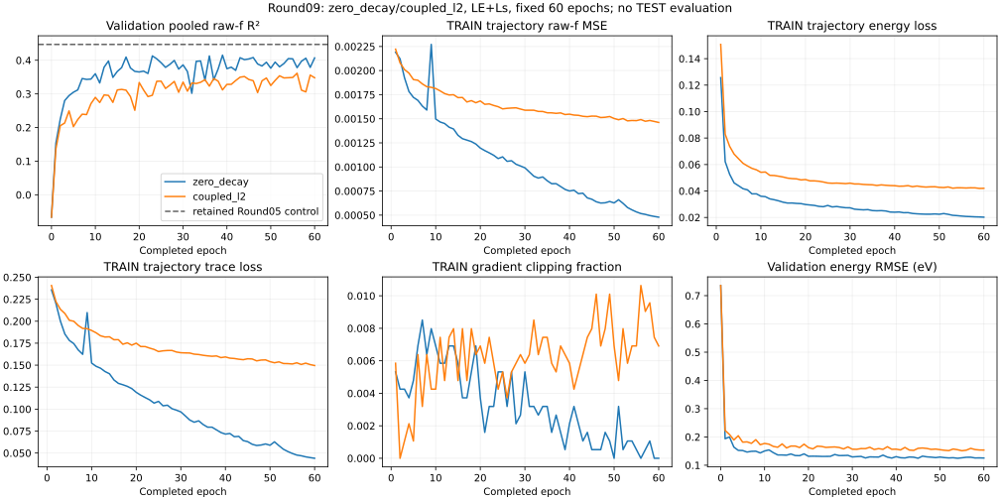
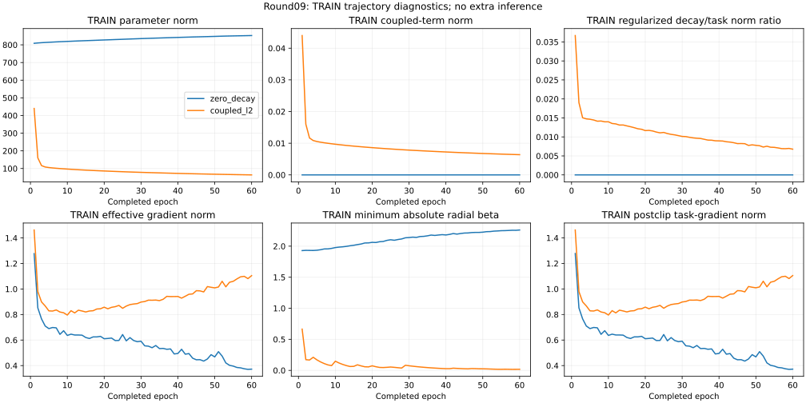

# Round09 — fixed coupled decay fails the promotion gate

**Coupled AdamAMSGrad decay 1e-4 lowers selected pooled raw-f R² from .415284 to .361496 in this paired run.** Both are below the retained Round05 original control at .447169. The frozen dual +.003 gate fails; this coefficient and budget establish no improvement or achievement of the .60 target.

Both arms completed 60 epochs and 112,860 updates, one original attempt each, no production failure or resume. Every validation uses all 6,686 molecules × ten states = 66,860 printed raw-f labels, including zeros. Earliest minimum pooled validation SSE across epochs 0–60 selects the checkpoint; fixed60 is reported separately. No calibration, averaging, permutation, exclusion or TEST scoring.

## Selected and fixed60 results

| Policy | Arm | Epoch | R² | f RMSE | f MAE | Energy RMSE (eV) | Energy MAE (eV) |
| --- | --- | --- | --- | --- | --- | --- | --- |
| selected_best | zero_decay | 39 | 0.415284 | 0.039174 | 0.018132 | 0.125263 | 0.091816 |
| selected_best | coupled_l2 | 56 | 0.361496 | 0.040936 | 0.020390 | 0.153195 | 0.112686 |
| fixed60 | zero_decay | 60 | 0.407024 | 0.039450 | 0.017621 | 0.125387 | 0.087468 |
| fixed60 | coupled_l2 | 60 | 0.348063 | 0.041365 | 0.019455 | 0.153662 | 0.114374 |
| retained selected | Round05 control | 45 | 0.447169 | 0.038091 | 0.017463 | 0.122983 | 0.089163 |

Selected coupled_l2 ΔR² is -0.053787 versus its contemporaneous control and -0.085673 versus retained. Each required at least +.003. No extension, seed allocation, coefficient sweep or optimizer replacement is authorized by this result.

## All states

### selected_best

Each state includes 6,686 labels. Cells show R² / RMSE / MAE.

| State | zero_decay | coupled_l2 |
| --- | --- | --- |
| S1 | 0.817823 / 0.019846 / 0.008554 | 0.736924 / 0.023849 / 0.011496 |
| S2 | 0.691914 / 0.028921 / 0.015103 | 0.588623 / 0.033420 / 0.020214 |
| S3 | 0.570012 / 0.031063 / 0.016962 | 0.417541 / 0.036153 / 0.020564 |
| S4 | 0.395211 / 0.035854 / 0.019328 | 0.281252 / 0.039086 / 0.021996 |
| S5 | 0.454704 / 0.035798 / 0.019250 | 0.362652 / 0.038702 / 0.020986 |
| S6 | 0.318999 / 0.038400 / 0.019433 | 0.253967 / 0.040191 / 0.021210 |
| S7 | 0.155320 / 0.045551 / 0.020748 | 0.193554 / 0.044508 / 0.021536 |
| S8 | 0.287217 / 0.044544 / 0.020925 | 0.191721 / 0.047434 / 0.022613 |
| S9 | 0.329070 / 0.057338 / 0.020617 | 0.377061 / 0.055249 / 0.021968 |
| S10 | 0.234162 / 0.041987 / 0.020403 | 0.200248 / 0.042906 / 0.021312 |

Coupled decay has lower state SSE than zero decay on S7, S9. All states remain included.

### fixed60

Each state includes 6,686 labels. Cells show R² / RMSE / MAE.

| State | zero_decay | coupled_l2 |
| --- | --- | --- |
| S1 | 0.831239 / 0.019102 / 0.007848 | 0.749925 / 0.023252 / 0.010397 |
| S2 | 0.724501 / 0.027349 / 0.014138 | 0.601343 / 0.032899 / 0.018893 |
| S3 | 0.614030 / 0.029430 / 0.015991 | 0.478841 / 0.034198 / 0.019382 |
| S4 | 0.424807 / 0.034966 / 0.018367 | 0.320718 / 0.037998 / 0.021111 |
| S5 | 0.440495 / 0.036261 / 0.019022 | 0.332336 / 0.039611 / 0.020482 |
| S6 | 0.350737 / 0.037494 / 0.018862 | 0.256516 / 0.040123 / 0.020699 |
| S7 | -0.015845 / 0.049953 / 0.020585 | 0.007017 / 0.049388 / 0.020803 |
| S8 | 0.297407 / 0.044224 / 0.020830 | 0.217732 / 0.046664 / 0.021753 |
| S9 | 0.289973 / 0.058985 / 0.020613 | 0.343471 / 0.056719 / 0.020755 |
| S10 | 0.256924 / 0.041358 / 0.019958 | 0.191322 / 0.043145 / 0.020280 |

Coupled decay has lower state SSE than zero decay on S7, S9. All states remain included.

## Bright tails, false bright predictions and concentrated error

Fixed TRAIN target thresholds q90=.0549 and q99=.2406 define the tails. These subgroups never alter pooled scores.

| Policy | Arm | Tail | Count | RMSE | MAE | SSE |
| --- | --- | --- | --- | --- | --- | --- |
| selected_best | zero_decay | q90 | 6782 | 0.097702 | 0.066249 | 64.738365 |
| selected_best | zero_decay | q99 | 708 | 0.224858 | 0.159046 | 35.797162 |
| selected_best | coupled_l2 | q90 | 6782 | 0.108482 | 0.075843 | 79.812208 |
| selected_best | coupled_l2 | q99 | 708 | 0.260109 | 0.209198 | 47.900990 |
| fixed60 | zero_decay | q90 | 6782 | 0.096869 | 0.065022 | 63.640049 |
| fixed60 | zero_decay | q99 | 708 | 0.223350 | 0.157310 | 35.318613 |
| fixed60 | coupled_l2 | q90 | 6782 | 0.108946 | 0.077690 | 80.497588 |
| fixed60 | coupled_l2 | q99 | 708 | 0.258124 | 0.207437 | 47.172607 |

The four q99 bins sum to all 66,860 labels and the full SSE. Cells show count / SSE. Bin membership depends on model predictions, so changes are descriptive decompositions, not causal effects on fixed subgroups.

| Policy | Arm | T0/P0 | T0/P1 false bright | T1/P0 missed bright | T1/P1 |
| --- | --- | --- | --- | --- | --- |
| selected_best | zero_decay | 65997 / 50.744368 | 155 / 16.063663 | 418 / 29.682902 | 290 / 6.114260 |
| selected_best | coupled_l2 | 66113 / 59.204829 | 39 / 4.937867 | 575 / 43.057371 | 133 / 4.843619 |
| fixed60 | zero_decay | 66011 / 50.084090 | 141 / 18.651825 | 412 / 30.422502 | 296 / 4.896111 |
| fixed60 | coupled_l2 | 66105 / 57.382027 | 47 / 9.846357 | 559 / 42.148650 | 149 / 5.023956 |

Coupled decay versus selected zero_decay: Δ pooled MAE 0.002257; Δ energy RMSE 0.027932 eV; Δ energy MAE 0.020870 eV; Δ true-q90 RMSE 0.010780; Δ true-q99 RMSE 0.035251; Δ false-bright SSE -11.125796. Positive error differences are worse.
Coupled decay versus retained Round05: Δ pooled MAE 0.002927; Δ energy RMSE 0.030212 eV; Δ energy MAE 0.023522 eV; Δ true-q90 RMSE 0.010453; Δ true-q99 RMSE 0.035127; Δ false-bright SSE -7.396626. Positive error differences are worse.

| Policy | Arm | Top1% count | Top1% SSE share | Prediction q99 | Prediction max | Error q99 | Error max |
| --- | --- | --- | --- | --- | --- | --- | --- |
| selected_best | zero_decay | 669 | 0.563117 | 0.198736 | 1.962319 | 0.153829 | 2.458651 |
| selected_best | coupled_l2 | 669 | 0.507116 | 0.148371 | 2.331107 | 0.167215 | 2.495489 |
| fixed60 | zero_decay | 669 | 0.583484 | 0.203040 | 2.417054 | 0.158124 | 2.470598 |
| fixed60 | coupled_l2 | 669 | 0.534325 | 0.146637 | 2.379957 | 0.167610 | 2.493631 |

Full SSE, MAE, counts and additional quantiles are in ROUND09_RESULTS.json. No error outlier was removed.

## Trajectories and optimizer diagnostics

TRAIN metrics are weighted pre-update minibatch trajectory aggregates, not fixed-checkpoint TRAIN evaluations. Validation is evaluated at each completed checkpoint. Both arms optimize original LE+Ls; reported raw-f MSE and decorrelation remain diagnostics. A difference between these TRAIN and validation summaries is not an exactly matched generalization-gap estimate.

| Arm/epoch | TRAIN f MSE | TRAIN LE | TRAIN Ls | VAL LE | VAL Ls | Clip fraction |
| --- | --- | --- | --- | --- | --- | --- |
| zero_decay/1 | 0.002190 | 0.125677 | 0.235660 | 0.069849 | 0.231007 | 0.005316 |
| zero_decay/39 | 0.000767 | 0.024083 | 0.073302 | 0.029182 | 0.151067 | 0.000532 |
| zero_decay/60 | 0.000479 | 0.020202 | 0.044055 | 0.029240 | 0.151989 | 0.000000 |
| coupled_l2/1 | 0.002222 | 0.150775 | 0.240600 | 0.092481 | 0.239579 | 0.005848 |
| coupled_l2/56 | 0.001492 | 0.042248 | 0.152655 | 0.043648 | 0.168504 | 0.010633 |
| coupled_l2/60 | 0.001462 | 0.042031 | 0.149560 | 0.043914 | 0.170530 | 0.006911 |

| Arm/epoch | Parameter norm | Coupled-term norm | Decay/task ratio | Effective gradient norm | Min |radial beta| | Offset min/max |
| --- | --- | --- | --- | --- | --- | --- |
| zero_decay/1 | 808.738548 | 0.000000 | 0.000000 | 1.277424 | 1.928875 | 5.417198 / 7.654118 |
| zero_decay/39 | 841.360542 | 0.000000 | 0.000000 | 0.491070 | 2.185511 | 5.471906 / 7.518878 |
| zero_decay/60 | 852.637210 | 0.000000 | 0.000000 | 0.372033 | 2.260595 | 5.493931 / 7.494824 |
| coupled_l2/1 | 439.942809 | 0.043994 | 0.036685 | 1.462427 | 0.664533 | 5.416713 / 7.642598 |
| coupled_l2/56 | 65.280669 | 0.006528 | 0.007105 | 1.078948 | 0.018543 | 3.434546 / 5.009172 |
| coupled_l2/60 | 63.816733 | 0.006382 | 0.006774 | 1.104774 | 0.017401 | 3.303843 / 4.866690 |

| Arm | Checkpoint | Parameter norm | Min |radial beta| | Offset min/max |
| --- | --- | --- | --- | --- |
| zero_decay | fixed60 | 852.857376 | 2.264156 | 5.497057 / 7.492028 |
| zero_decay | selected_best | 841.655623 | 2.195434 | 5.472208 / 7.514449 |
| coupled_l2 | fixed60 | 63.640294 | 0.017400 | 3.304068 / 4.836204 |
| coupled_l2 | selected_best | 65.080167 | 0.019233 | 3.434519 / 4.975100 |

Task gradients are clipped at5 before Adam adds lambda*p internally and before first/second/AMSGrad-max moment updates. This is coupled L2, not AdamW; the effective gradient is not clipped a second time. Detached norms use the same grad!=None subset; ratio denominator is max(task norm,1e-12), with zero/below-floor counts preserved. Means are molecule weighted, radial beta is an epoch minimum, offset extrema are recorded extrema. Effective-gradient norm is not the adaptive update norm.

Every recorded epoch has135 live-gradient parameters and no grad=None parameters. Dormant right-F tensors remain unchanged across selected/final checkpoints; both transport theta tensors remain exactly zero. Radial and offset summaries document the broad all-parameter decay treatment; they do not identify why errors changed. No nonfinite failure, missing optimizer state or resource interruption was observed, and no coefficient or parameter exclusion was adjusted.

## Conditional uncertainty and repeated-control limits

The paired bootstrap resamples 5656 validation identity groups from the fixed6,686-molecule cohort, retaining all molecules and ten states together within each sampled group. Draw molecule counts vary. Seed20260930, 2000 draws, recomputed pooled SST. These descriptive intervals are conditional on the chosen checkpoints and reused validation; they do not capture checkpoint-selection or training-seed uncertainty. The retained aggregate has no paired interval.

| Policy | Contrast | Delta R² | Descriptive95% interval |
| --- | --- | --- | --- |
| selected_best | coupled_l2_minus_zero_decay | -0.053787 | [-0.096794, -0.009862] |
| fixed60 | coupled_l2_minus_zero_decay | -0.058961 | [-0.090203, -0.028389] |

Declared original controls previously selected .447169 (Round05), .404798 (Round06), .409104 (Round07), .417636 (Round08), and .415284 here. Common initial tensors/order/settings do not guarantee identical CUDA trajectories; wrappers, diagnostics and workloads across rounds differ. No source of that variation was isolated. This matched pair is evidence against the specified coefficient/parameter treatment at this budget, not proof that regularization in general fails or that a particular physical or generalization mechanism caused the result.

## Fixed recipe and artifacts

Original PSD MTO16/query32/router128/head128, core128/three blocks, fresh seed/order11 and newTRAIN-only statistics. Original LE+Ls, AdamAMSGrad LR.001/betas(.9,.999)/eps1e-8/batch64/clip5, FP32/noAMP/noTF32/two threads, fixed60 without scheduler/early stopping. One ordered135-tensor group contains1,552,092 values, including biases, normalization, embeddings, offsets and trainable radial parameters. Exactly11 dormant right-F/transport tensors and all buffers are excluded. foreach/fused remainNone; grad=None would skip decay/state, whereas a zero gradient receives decay. Only weight_decay differs:0 versus1e-4. The five toy steps and six discarded technical TRAIN updates never initialize production.

Native f = 2 E_eV trace(A) / (3 × 27.211386245988), evaluated in FP64 against printed raw-f targets. Predicted energy uses unchanged softplus and A is PSD; no teacher energy or output repair. Geometry-only exports embed config, TRAIN statistics, original mode/contract and one full model. Forward inputs are (z,pos,batch,n,edge_index).

| Arm | Selected epoch | Server standalone checkpoint | SHA256 |
| --- | --- | --- | --- |
| zero_decay | 39 | /home/inspur/MTO-1/research/single_model_20260929/round09_regularization_preparation/runs/zero_decay/geometry_best.pt | 7443fd31430f1539cd6106a675c2dec2f4b1b3783c20e6f1a3dd569a3ae81435 |
| coupled_l2 | 56 | /home/inspur/MTO-1/research/single_model_20260929/round09_regularization_preparation/runs/coupled_l2/geometry_best.pt | 29c8834ac59fe5986fc0b80dfb50b769358535e33d71bc5293037cb3585d860e |

| Arm | Measured train+validation hours |
| --- | --- |
| zero_decay | 3.091368 |
| coupled_l2 | 3.091715 |

The retained v2 reference is still Round05 original control45: `/home/inspur/MTO-1/research/single_model_20260929/round05_scratch_preparation/runs/control/geometry_best.pt`, SHA `e71c63da8bb3b8214e014ca64946fecab97fbc210cb068c0b1a3eefa3bbf8f1e`, R² .44716940136585204. Use its matching Round05 loader. It remains below .60, without current TEST or independent-seed confirmation.

All360 source pins, authority/review/publication,60 orders,61 history rows,112860 updates, earliest selection,135 optimizer members/options/moments/steps/RNG, access ledgers and checkpoint hashes passed. Standalone tensors equal selected checkpoint tensors; mode/contract/provenance match. Stored buffer fingerprint format is valid; strict buffer reconstruction/export parity was a preparation check, not a new terminal forward. Process absence is exit evidence, not an observed child OS exit code.

This analysis reads four saved validation output sets, CPU checkpoint contents, validation component metadata and the published retained aggregate. It creates no model and opens no raw dataset targets or TEST arrays. Every saved truth/mask agrees. Weights, optimizer tensors, raw/private identity and prediction arrays stay server-only; lightweight manifests never expand opaque input hashes into payloads. Exact commands and recovery/completed-stage refusal are in ROUND09_REPRODUCE.md.

The v2 partition is disjoint under audited conservative identity rules, not absolute chemical-identity proof or external fresh data. Its sealed TEST contains5,989 oldTRAIN,361 oldvalidation and336 oldTEST rows. Historical exposure, reused validation, one initialization and control variability limit conclusions. The initial technical GPU1 admission rejection occurred before a scientific child/update; its snapshot and successful separate GPU4 six-update retry remain preserved. Production onGPU1/2 completed without retry.

## Decision boundary

The fixed coupled-decay contrast fails its promotion gate. Retain the Round05 reference and preserve this negative result; no coefficient sweep, new group exclusions, AdamW substitution, extension, seeds, TEST release or next numerical pilot follows automatically. Root owns closeout and D-first publication.

